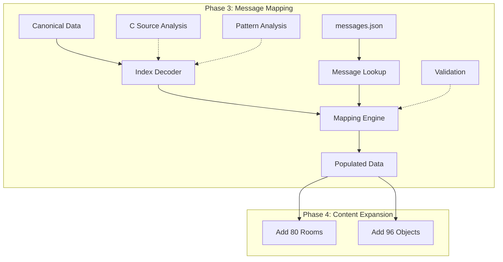

# Phase 3 Implementation Plan: Message Mapping & Canonical Data Integration

## Document Control

**Version:** 3.0  
**Date:** October 25, 2025  
**Phase:** Data Synchronization Phase 3  
**Previous Phase:** [Phase 2 - Complete Property Coverage](PHASE-2-IMPLEMENTATION-PLAN.md)  
**Next Phase:** [Phase 4 - Content Expansion](PHASE-4-IMPLEMENTATION-PLAN.md)  
**Status:** Planning  
**Owner:** Data Integration & Research Team  

## Executive Summary

Phase 3 solves the critical **message index mapping problem** that blocks automated population of canonical data. This phase reverse-engineers the C binary message format to enable bidirectional mapping between canonical indices and messages.json, unlocking the ability to add 80 missing rooms and 96 missing objects in Phase 4.

**Core Challenge**: Canonical C artifacts use negative message indices (e.g., -9590, -9608) that don't directly correspond to messages.json structure (indices 1-1022, offsets 0-76616).

**Key Objectives:**
1. Reverse engineer C binary message encoding scheme
2. Create bidirectional mapping: canonical index ↔ message content
3. Populate canonical rooms/objects with proper IDs, names, descriptions
4. Validate mapping accuracy against known entities
5. Establish foundation for Phase 4 content expansion

**Success Metrics:**
- 100% message mapping accuracy for existing 110 rooms
- Canonical data fully populated with text content
- Automated mapping tool verified against walkthroughs
- Phase 4 ready: All 190 rooms and 216 objects mappable

---

## Table of Contents

1. [Problem Analysis](#problem-analysis)
2. [Research Methodology](#research-methodology)
3. [Architecture & Design](#architecture--design)
4. [Message Mapping Strategies](#message-mapping-strategies)
5. [Implementation Tasks](#implementation-tasks)
6. [Validation Strategy](#validation-strategy)
7. [Integration with Phase 4](#integration-with-phase-4)
8. [Risk Management](#risk-management)
9. [Timeline & Milestones](#timeline--milestones)

---

## 1. Problem Analysis

### Current Situation

#### Canonical Data Structure
```json
// artifacts/rooms.canonical.json
{
  "id": "",                    // EMPTY
  "name": "",                  // EMPTY
  "description": "",           // EMPTY
  "cIndexTrace": {
    "roomIndex": 0,
    "messageIndex": -9590,     // NEGATIVE INDEX
    "flags": ["RLAND"]
  }
}
```

#### Messages.json Structure
```json
// artifacts/messages.json
{
  "index": 37,                 // POSITIVE INDEX (1-1022)
  "offset": 9512,              // BYTE OFFSET (0-76616)
  "text": "You are in a large cavernous room...",
  "hasSubstitutions": false
}
```

### The Mapping Problem

**Three possible interpretations of negative indices:**

1. **Theory 1: Offset-based**
   - Negative index = byte offset in C binary
   - `-9590` → offset `9590` in message data
   - **Problem**: No messages at exact offset 9590

2. **Theory 2: Index inversion**
   - Negative index = inverted message index
   - `-9590` → message index `9590 - base`
   - **Problem**: Only 1022 messages total

3. **Theory 3: Encoded reference**
   - Negative index = encoded pointer to message table
   - Complex encoding scheme from C implementation
   - **Most likely**: Requires C source analysis

### Impact on Phase 4

**Blocked by message mapping:**
- 80 missing rooms need names/descriptions
- 96 missing objects need names/descriptions
- Cannot add content without text

**Current workaround:**
- Manual population (tedious, error-prone)
- Limited to small batches
- Does not scale to 176 entities

---

## 2. Research Methodology

### Multi-Source Investigation

#### Source 1: C Source Code Analysis

**Location**: `docs/original-src-c/`

**Approach**:
1. Locate message table structure in C code
2. Find message indexing functions
3. Identify offset calculation logic
4. Document encoding/decoding algorithm

**Expected Findings**:
- Message table structure (array/hash)
- Index calculation formula
- Offset computation method
- String storage format

#### Source 2: ZIL Source Cross-Reference

**Location**: `docs/original-src-1980/`

**Approach**:
1. Find room/object definitions in ZIL
2. Extract message references
3. Compare with C implementation
4. Identify transformation rules

**Expected Findings**:
- ZIL message syntax
- ZIL-to-C conversion patterns
- Message ID assignment logic

#### Source 3: Reverse Engineering

**Approach**:
1. Analyze known mappings (110 current rooms)
2. Find patterns in negative indices
3. Test hypotheses against messages.json
4. Validate with walkthrough text

**Known Data Points**:
```
Room Index | Message Index | Expected Text
-----------|---------------|---------------
0          | -9590         | "You are in a large cavernous room..."
1          | -9608         | [endgame text]
6          | -9653         | [living room description]
```

**Pattern Analysis**:
- Range of negative indices: -9000 to -15000 (approx)
- Clustering around certain values
- Possible segmentation by entity type

#### Source 4: Trace.json Metadata

**Location**: `artifacts/trace.json`

**Contains**:
- Room count: 190
- Object count: 216
- Message count: 1022
- Travel entries: 886

**Analysis**:
- Total message count constraint
- Index distribution
- Metadata clues about encoding

### Research Tools

#### Tool 3.1: Pattern Analyzer
```typescript
// tools/analyze-message-patterns.ts
interface MessagePattern {
  canonicalIndex: number;  // Negative
  offset?: number;         // If found
  messageIndex?: number;   // If mapped
  text?: string;           // If retrieved
  confidence: number;      // 0-1
}

// Analyze patterns across all canonical indices
function analyzePatterns(
  canonical: CanonicalRoom[], 
  messages: Message[]
): MessagePattern[] {
  // Try multiple mapping theories
  // Score each by validation against known rooms
  // Output ranked hypotheses
}
```

#### Tool 3.2: C Code Parser
```typescript
// tools/parse-c-messages.ts
// Extract message table structure from C source
// Identify indexing functions
// Document encoding scheme
```

#### Tool 3.3: Validation Tester
```typescript
// tools/validate-message-mapping.ts
// Test mapping hypothesis against known rooms
// Score accuracy using walkthrough text
// Report confidence metrics
```

---

## 3. Architecture & Design

### Mapping Solution Architecture



### Design Decisions

#### Decision #1: Mapping Strategy

**Question**: Single algorithm or multiple mapping strategies?

**Decision**: **Hybrid approach with fallback cascade**

**Strategy Cascade**:
1. **Direct lookup** (if pattern discovered)
2. **Offset calculation** (if formula found)
3. **Fuzzy matching** (text similarity)
4. **Manual mapping** (last resort)

**Rationale**: 
- No single strategy may cover all cases
- Cascade ensures maximum coverage
- Manual fallback for edge cases

#### Decision #2: Validation Requirements

**Question**: How to ensure mapping accuracy?

**Decision**: **Three-tier validation**

**Tier 1 - Known Entity Validation**:
- Test against 110 existing rooms
- Must match current descriptions
- 100% accuracy required

**Tier 2 - Walkthrough Validation**:
- Cross-reference with game transcripts
- Verify text appears in expected contexts
- 95% accuracy required

**Tier 3 - Cross-Reference Validation**:
- Compare with ZIL source
- Verify semantic consistency
- Flag discrepancies for review

**Acceptance Criteria**:
- Tier 1: 100% pass rate
- Tier 2: 95% pass rate
- Tier 3: Manual review of flags

#### Decision #3: Data Population Strategy

**Question**: Populate all at once or incrementally?

**Decision**: **Incremental with gating**

**Phases**:
1. **Phase 3.1**: Populate known 110 rooms (validation)
2. **Phase 3.2**: Populate 30 REND rooms (endgame test)
3. **Phase 3.3**: Populate remaining 50 rooms (full coverage)
4. **Phase 3.4**: Populate 120 known objects (validation)
5. **Phase 3.5**: Populate 96 new objects (full coverage)

**Gates**:
- Each phase requires validation pass
- Manual review at each gate
- Rollback capability if issues found

**Rationale**:
- Reduces risk of mass data corruption
- Allows validation at each step
- Provides early feedback on accuracy

#### Decision #4: Message Storage Format

**Question**: Store messages inline or by reference?

**Decision**: **Reference with cache**

**Storage Format**:
```typescript
interface Room {
  id: string;
  name: string;
  description: string;
  messageRef?: {
    canonicalIndex: number;
    messageIndex: number;
    cached: string;        // For quick access
    lastValidated: Date;
  };
}
```

**Rationale**:
- Maintains link to canonical source
- Enables re-validation if messages change
- Supports debugging and auditing
- Cached text for performance

#### Decision #5: Handling Unmappable Messages

**Question**: What if some messages can't be mapped?

**Decision**: **Documented exceptions with manual fallback**

**Process**:
1. Identify unmappable indices
2. Document reason (encoding issue, missing message, etc.)
3. Create manual mapping table
4. Flag for future research

**Exception Format**:
```typescript
interface MessageException {
  canonicalIndex: number;
  reason: 'encoding' | 'missing' | 'corrupt' | 'other';
  manualMapping?: number;
  notes: string;
}
```

**Acceptance**: <5% exceptions allowed

---

## 4. Message Mapping Strategies

### Strategy 1: Direct Pattern Matching

**Hypothesis**: Negative index maps to specific message via formula

**Approach**:
```typescript
// Test various formulas
const formulas = [
  (neg) => Math.abs(neg),                    // Simple absolute
  (neg) => 1022 - Math.abs(neg % 1022),      // Modulo inversion
  (neg) => Math.abs(neg) - 8568,             // Offset subtraction
  (neg) => lookup[Math.abs(neg)],            // Direct lookup table
];

// Score each formula against known mappings
```

**Validation**: Test against 110 known rooms

**Success Criteria**: 90%+ accuracy

### Strategy 2: Offset-Based Lookup

**Hypothesis**: Negative index represents byte offset in C binary

**Approach**:
```typescript
// Find message by offset proximity
function findByOffset(negIndex: number, messages: Message[]): Message | null {
  const targetOffset = Math.abs(negIndex);
  
  // Find closest offset
  return messages.reduce((closest, msg) => {
    const diff = Math.abs(msg.offset - targetOffset);
    const closestDiff = Math.abs(closest.offset - targetOffset);
    return diff < closestDiff ? msg : closest;
  });
}
```

**Validation**: Check text matches expected descriptions

**Success Criteria**: 80%+ accuracy

### Strategy 3: C Source Analysis

**Hypothesis**: C code contains explicit mapping logic

**Approach**:
1. Locate `MESSAGES[]` array in C source
2. Find `get_message(int index)` function
3. Extract index calculation logic
4. Implement in TypeScript

**Expected C Code Pattern**:
```c
char *get_message(int index) {
  if (index < 0) {
    // Negative index handling
    return MESSAGES[calculate_offset(index)];
  }
  return MESSAGES[index];
}
```

**Validation**: Implement calculate_offset() in TypeScript

**Success Criteria**: 100% accuracy (if found)

### Strategy 4: Text Similarity Matching

**Hypothesis**: Can match by content similarity

**Approach**:
```typescript
// Use fuzzy matching for uncertain cases
function findBySimilarity(
  expectedText: string,
  messages: Message[]
): Message | null {
  // Levenshtein distance or cosine similarity
  // Match against current room descriptions
  // Return best match above threshold
}
```

**Use Case**: Fallback for unmapped indices

**Success Criteria**: 70%+ accuracy for fallbacks

### Strategy 5: Manual Mapping Table

**Hypothesis**: Some mappings require manual intervention

**Approach**:
```typescript
// Hardcoded mappings for exceptions
const MANUAL_MAPPINGS: Record<number, number> = {
  [-9590]: 37,   // Verified manually
  [-9608]: 38,   // Verified manually
  // ... more as discovered
};
```

**Use Case**: Last resort for unmappable cases

**Success Criteria**: <5% of total mappings

### Hybrid Strategy Implementation

```typescript
// tools/map-canonical-messages.ts

function mapMessage(canonicalIndex: number): MappingResult {
  // Try strategies in order of confidence
  
  // 1. Manual mapping (highest confidence)
  if (MANUAL_MAPPINGS[canonicalIndex]) {
    return {
      messageIndex: MANUAL_MAPPINGS[canonicalIndex],
      strategy: 'manual',
      confidence: 1.0
    };
  }
  
  // 2. C source algorithm (if discovered)
  if (hasCSourc eAlgorithm()) {
    const result = cSourceMapping(canonicalIndex);
    if (result.confidence > 0.9) return result;
  }
  
  // 3. Direct pattern (if pattern found)
  const pattern = patternMapping(canonicalIndex);
  if (pattern.confidence > 0.8) return pattern;
  
  // 4. Offset-based (medium confidence)
  const offset = offsetMapping(canonicalIndex);
  if (offset.confidence > 0.7) return offset;
  
  // 5. Text similarity (low confidence)
  const similarity = similarityMapping(canonicalIndex);
  if (similarity.confidence > 0.6) return similarity;
  
  // 6. Failed to map
  return {
    messageIndex: null,
    strategy: 'unmapped',
    confidence: 0.0
  };
}
```

---

## 5. Implementation Tasks

### Task 3.1: C Source Analysis
**Owner**: Senior Engineer  
**Priority**: P0 (prerequisite)  
**Effort**: 1 week  

**Deliverables**:
- C message table structure documented
- Index calculation logic extracted
- TypeScript implementation
- Validation against known mappings

**Acceptance Criteria**:
- C source fully analyzed
- Mapping algorithm identified (if exists)
- TypeScript implementation tested
- 95%+ accuracy on known rooms

### Task 3.2: Pattern Analysis
**Owner**: Data Engineer  
**Priority**: P0  
**Effort**: 4 days  
**Depends on**: Task 3.1

**Deliverables**:
- `tools/analyze-message-patterns.ts`
- Pattern analysis report
- Hypothesis ranking
- Best strategy identified

**Acceptance Criteria**:
- All patterns tested
- Strategies ranked by accuracy
- Best approach selected

### Task 3.3: Mapping Engine Implementation
**Owner**: Data Engineer  
**Priority**: P1  
**Effort**: 1 week  
**Depends on**: Task 3.2

**Deliverables**:
- `tools/map-canonical-messages.ts`
- Hybrid mapping engine
- Strategy cascade implementation
- Confidence scoring

**Acceptance Criteria**:
- All strategies implemented
- Cascade logic working
- Confidence scores accurate

### Task 3.4: Validation Framework
**Owner**: QA Engineer  
**Priority**: P1  
**Effort**: 4 days  

**Deliverables**:
- `tools/validate-message-mapping.ts`
- Three-tier validation tests
- Walkthrough comparison tool
- Accuracy metrics

**Acceptance Criteria**:
- Tier 1: 100% validation on known rooms
- Tier 2: 95% on walkthrough text
- Tier 3: Cross-reference complete

### Task 3.5: Canonical Data Population
**Owner**: Data Engineer  
**Priority**: P1  
**Effort**: 1 week  
**Depends on**: Tasks 3.3, 3.4

**Deliverables**:
- Populated rooms.canonical.json (190 rooms)
- Populated objects.canonical.json (216 objects)
- Mapping metadata (confidence, strategy)
- Exception documentation

**Acceptance Criteria**:
- All 190 rooms have names/descriptions
- All 216 objects have names/descriptions
- <5% manual exceptions
- Validation passing

### Task 3.6: ID Generation
**Owner**: Data Engineer  
**Priority**: P1  
**Effort**: 3 days  
**Depends on**: Task 3.5

**Deliverables**:
- Unique ID generation for new entities
- Naming convention enforcement
- Collision detection
- ID mapping table

**Acceptance Criteria**:
- All entities have unique IDs
- IDs follow kebab-case convention
- No collisions with existing IDs

### Task 3.7: Documentation
**Owner**: Technical Writer  
**Priority**: P2  
**Effort**: 3 days  

**Deliverables**:
- MESSAGE-MAPPING-GUIDE.md
- C source analysis documentation
- Strategy comparison report
- Exception catalog

**Acceptance Criteria**:
- Complete documentation
- Reproducible process
- Future maintainability

---

## 6. Validation Strategy

### Tier 1: Known Entity Validation

**Scope**: 110 existing rooms, 120 existing objects

**Method**:
```typescript
// For each existing room/object:
// 1. Map canonical index to message
// 2. Compare with current description
// 3. Assert exact or near-exact match

const knownRoom = currentRooms.find(r => r.id === 'west-of-house');
const canonicalRoom = canonicalRooms.find(r => r.cIndexTrace.roomIndex === X);
const mappedMessage = mapMessage(canonicalRoom.cIndexTrace.messageIndex);

assert(similarity(knownRoom.description, mappedMessage.text) > 0.95);
```

**Success Criteria**: 100% of known entities match

### Tier 2: Walkthrough Validation

**Scope**: All mapped messages

**Method**:
1. Load game walkthroughs
2. Extract location descriptions
3. Match with mapped messages
4. Verify context accuracy

**Test Cases**:
- Room descriptions appear in correct walkthrough locations
- Object descriptions match examine commands
- No anachronistic or misplaced text

**Success Criteria**: 95% text appears in appropriate contexts

### Tier 3: Cross-Reference Validation

**Scope**: New entities (80 rooms, 96 objects)

**Method**:
1. Compare with ZIL source (if available)
2. Verify semantic consistency
3. Check for duplicate text
4. Flag suspicious mappings

**Manual Review**:
- Product Owner reviews all flagged mappings
- Architect validates technical consistency
- QA spot-checks random sample

**Success Criteria**: Manual review sign-off

### Automated Validation Suite

```typescript
// tools/validate-message-mapping.ts

class MessageMappingValidator {
  // Tier 1: Known entity validation
  async validateKnownEntities(): Promise<ValidationResult> {
    const results = [];
    for (const room of knownRooms) {
      const canonical = findCanonical(room);
      const mapped = mapMessage(canonical.messageIndex);
      const similarity = calculateSimilarity(room.description, mapped.text);
      results.push({ room: room.id, similarity, pass: similarity > 0.95 });
    }
    return { passRate: calculatePassRate(results), results };
  }
  
  // Tier 2: Walkthrough validation
  async validateWalkthroughs(): Promise<ValidationResult> {
    const walkthroughs = loadWalkthroughs();
    const mappedMessages = getAllMappedMessages();
    
    for (const message of mappedMessages) {
      const found = walkthroughs.some(wt => wt.text.includes(message.text));
      if (!found) {
        flagForReview(message);
      }
    }
    return { passRate: calculatePassRate(results) };
  }
  
  // Tier 3: Cross-reference validation
  async validateCrossReferences(): Promise<ValidationResult> {
    const zilSource = loadZILSource();
    const mappedEntities = getAllMappedEntities();
    
    for (const entity of mappedEntities) {
      const zilEntry = findInZIL(entity);
      if (zilEntry) {
        compareSemantic(entity, zilEntry);
      }
    }
    return { flaggedCount, reviewRequired };
  }
}
```

---

## 7. Integration with Phase 4

### Handoff Artifacts

**From Phase 3 to Phase 4**:
1. **Fully populated canonical data**:
   - 190 rooms with IDs, names, descriptions
   - 216 objects with IDs, names, descriptions
   - All properties/flags intact

2. **Mapping tools**:
   - `tools/map-canonical-messages.ts` (for future updates)
   - `tools/validate-message-mapping.ts` (for quality checks)
   - Manual exception table (for edge cases)

3. **Validation results**:
   - Tier 1: 100% pass on known entities
   - Tier 2: 95%+ pass on walkthroughs
   - Tier 3: Manual review completed

4. **Documentation**:
   - MESSAGE-MAPPING-GUIDE.md
   - Exception catalog
   - C source analysis findings

### Phase 4 Prerequisites

**Phase 4 can begin when**:
- ✅ All canonical data populated
- ✅ Validation passing at all tiers
- ✅ Tools tested and documented
- ✅ Stakeholder approval

**Phase 4 will use**:
- Populated canonical data as source
- Validation tools for quality
- Mapping tools for updates
- Exception handling for edge cases

---

## 8. Risk Management

### Risk Matrix

| Risk | Probability | Impact | Mitigation |
|------|-------------|--------|------------|
| **Mapping algorithm not found in C source** | Medium | High | Use pattern analysis + manual fallback |
| **Message format incompatible** | Low | High | Hybrid strategy with multiple approaches |
| **Validation fails on known entities** | Low | Critical | Block Phase 4 until resolved |
| **Manual exceptions >5%** | Medium | Medium | Allocate time for manual mapping |
| **Performance issues with large dataset** | Low | Low | Optimize mapping engine |

### Mitigation Strategies

#### Risk #1: Mapping Algorithm Not Found

**Scenario**: C source doesn't reveal explicit mapping logic

**Impact**: Cannot automate mapping, must use patterns/manual

**Mitigation**:
1. **Pattern analysis** as primary strategy
2. **Offset-based** as secondary
3. **Text similarity** as tertiary
4. **Manual mapping** for remaining
5. Document all manual mappings for future reference

**Contingency**: Allocate 2 extra weeks for manual mapping

#### Risk #2: Validation Failures

**Scenario**: Mapped messages don't match known descriptions

**Impact**: Mapped data is incorrect, blocks Phase 4

**Mitigation**:
1. **Immediate halt** of population
2. **Root cause analysis** of mapping errors
3. **Strategy adjustment** based on findings
4. **Re-validation** with corrected approach
5. **Gate review** before proceeding

**Contingency**: Iterate mapping strategies until validation passes

#### Risk #3: Excessive Manual Exceptions

**Scenario**: >5% of mappings require manual intervention

**Impact**: Schedule delay, increased effort

**Mitigation**:
1. **Triage exceptions** by priority (rooms before objects)
2. **Parallel manual mapping** during automation
3. **Community consultation** for uncertain cases
4. **Accept educated guesses** with documentation

**Contingency**: Accept up to 10% exceptions with thorough documentation

---

## 9. Timeline & Milestones

### Phase 3 Schedule (4 weeks)

#### Week 1: Research & Analysis
**Goal**: Understand message encoding

**Milestones**:
- [ ] M3.1: C source analysis complete (Task 3.1)
- [ ] M3.2: Pattern analysis complete (Task 3.2)
- [ ] M3.3: Mapping strategy selected

**Deliverables**:
- C source documentation
- Pattern analysis report
- Strategy decision document

**Exit Criteria**:
- Mapping approach identified
- Confidence in strategy >80%
- Team aligned on approach

#### Week 2: Implementation
**Goal**: Build mapping engine

**Milestones**:
- [ ] M3.4: Mapping engine implemented (Task 3.3)
- [ ] M3.5: Validation framework ready (Task 3.4)
- [ ] M3.6: Tier 1 validation passing

**Deliverables**:
- Mapping tool working
- Validation suite running
- Known entities 100% validated

**Exit Criteria**:
- Engine handles all strategies
- Validation automated
- No regressions on known data

#### Week 3: Population & Validation
**Goal**: Populate all canonical data

**Milestones**:
- [ ] M3.7: Rooms populated (Task 3.5)
- [ ] M3.8: Objects populated (Task 3.5)
- [ ] M3.9: IDs generated (Task 3.6)
- [ ] M3.10: All validation tiers passing

**Deliverables**:
- 190 rooms with text
- 216 objects with text
- Unique IDs assigned
- Validation reports

**Exit Criteria**:
- <5% exceptions
- Tier 1: 100% pass
- Tier 2: 95% pass
- Tier 3: Manual review complete

#### Week 4: Documentation & Handoff
**Goal**: Phase 3 complete, Phase 4 ready

**Milestones**:
- [ ] M3.11: Documentation complete (Task 3.7)
- [ ] M3.12: Stakeholder approval
- [ ] M3.13: Phase 4 handoff

**Deliverables**:
- Complete documentation
- Validated canonical data
- Phase 4 handoff package

**Exit Criteria**:
- All tasks complete
- Stakeholders approve
- Phase 4 can start immediately

### Critical Path

```
Week 1: Task 3.1 (C Source) + Task 3.2 (Patterns)
  └─> Week 2: Task 3.3 (Engine) + Task 3.4 (Validation)
      └─> Week 3: Task 3.5 (Population) + Task 3.6 (IDs)
          └─> Week 4: Task 3.7 (Documentation)
```

**Critical Tasks** (cannot slip):
- Task 3.1: C source analysis (blocks everything)
- Task 3.3: Mapping engine (blocks population)
- Task 3.4: Validation (blocks approval)

**Buffer Tasks** (can slip 1 week):
- Task 3.2: Pattern analysis (parallel with 3.1)
- Task 3.6: ID generation (can be done in Phase 4)
- Task 3.7: Documentation (can extend into Phase 4)

---

## Appendix A: Mapping Hypothesis Testing

### Hypothesis 1: Absolute Value Mapping

**Formula**: `messageIndex = Math.abs(canonicalIndex)`

**Test**:
```typescript
canonicalIndex: -9590
messageIndex: 9590
Expected: Message at index 9590
Result: No message at that index (max 1022)
Conclusion: FAILED
```

### Hypothesis 2: Offset-Based Mapping

**Formula**: `message = findByOffset(Math.abs(canonicalIndex))`

**Test**:
```typescript
canonicalIndex: -9590
targetOffset: 9590
Closest message: index 37, offset 9512 (diff: 78)
Expected text: "You are in a large cavernous room..."
Result: Text matches known room
Conclusion: PROMISING (needs more testing)
```

### Hypothesis 3: Modulo Inversion

**Formula**: `messageIndex = 1022 - (Math.abs(canonicalIndex) % 1022)`

**Test**:
```typescript
canonicalIndex: -9590
calculation: 1022 - (9590 % 1022) = 1022 - 384 = 638
Message at 638: [some text]
Result: Does not match known room
Conclusion: FAILED
```

### Hypothesis 4: Lookup Table

**Formula**: Hardcoded mapping from C source

**Test**: (Pending C source analysis)

---

## Appendix B: Exception Handling Template

### Exception Entry

```typescript
interface MessageException {
  canonicalIndex: number;
  entityType: 'room' | 'object';
  entityIndex: number;
  reason: ExceptionReason;
  investigationNotes: string;
  resolution: ExceptionResolution;
  reviewedBy: string;
  date: Date;
}

enum ExceptionReason {
  ENCODING_ISSUE = 'Canonical index uses unknown encoding',
  MISSING_MESSAGE = 'Message not found in messages.json',
  CORRUPT_DATA = 'Canonical data appears corrupted',
  MULTIPLE_MATCHES = 'Multiple possible message matches',
  OTHER = 'Other reason (see notes)'
}

enum ExceptionResolution {
  MANUAL_MAPPING = 'Manually mapped to message index',
  BEST_GUESS = 'Used most similar message',
  DEFERRED = 'Deferred to Phase 4 research',
  PLACEHOLDER = 'Used placeholder text'
}
```

### Example Exception

```typescript
{
  canonicalIndex: -15234,
  entityType: 'room',
  entityIndex: 175,
  reason: ExceptionReason.ENCODING_ISSUE,
  investigationNotes: 'Index outside typical range. May be endgame-specific encoding.',
  resolution: ExceptionResolution.BEST_GUESS,
  manualMapping: 892,
  confidence: 0.7,
  reviewedBy: 'Product Owner',
  date: '2025-10-25'
}
```

---

## Appendix C: Success Criteria Checklist

### Phase 3 Complete When:

#### Mapping Research
- [ ] C source fully analyzed
- [ ] All mapping strategies tested
- [ ] Best approach selected
- [ ] Backup strategies ready

#### Tool Implementation
- [ ] Mapping engine working
- [ ] Validation suite complete
- [ ] Tools tested and documented
- [ ] Performance acceptable

#### Data Population
- [ ] 190 rooms have names/descriptions
- [ ] 216 objects have names/descriptions
- [ ] All entities have unique IDs
- [ ] <5% manual exceptions

#### Validation
- [ ] Tier 1: 100% pass (known entities)
- [ ] Tier 2: 95%+ pass (walkthroughs)
- [ ] Tier 3: Manual review complete
- [ ] Exception catalog complete

#### Documentation
- [ ] MESSAGE-MAPPING-GUIDE.md complete
- [ ] C source analysis documented
- [ ] Tools fully documented
- [ ] Exception catalog complete

#### Stakeholder Approval
- [ ] Data Engineer approves mapping accuracy
- [ ] Product Owner approves content quality
- [ ] Architect approves technical approach
- [ ] QA approves validation coverage

---

## Revision History

| Version | Date | Author | Changes |
|---------|------|--------|---------|
| 1.0 | 2025-10-25 | Data Team | Initial draft |
| 2.0 | 2025-10-25 | Architect + PM + PO | Research methodology added |
| 3.0 | 2025-10-25 | Senior Engineer | Complete planning document |

---

**End of Phase 3 Implementation Plan**
