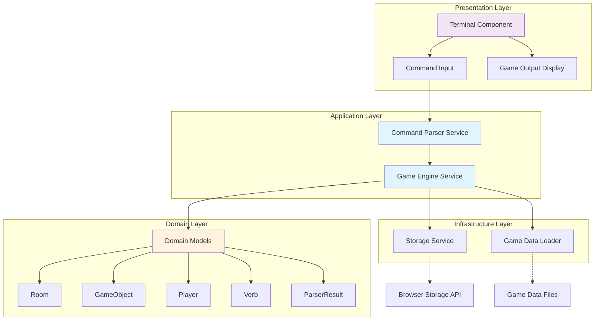

# Zork Game Engine Architecture

## Overview

The Zork Web game engine follows a clean, layered architecture built on Angular 20 and TypeScript. The design emphasizes separation of concerns, testability, and maintainability through SOLID principles.

## Architecture Diagram

## Core Components

### Domain Models

Located in `src/app/core/models/`, these TypeScript interfaces define the game's domain:

#### Room
Represents a location in the game world.

**Properties:**
- `id`: Unique identifier
- `name`: Display name
- `description`: Full description shown on first visit
- `shortDescription`: Brief description for revisits
- `exits`: Map of directions to room IDs
- `objectIds`: Objects present in the room
- `visited`: Whether player has been here

#### GameObject
Represents an interactive object in the game.

**Properties:**
- `id`: Unique identifier
- `name`: Display name
- `aliases`: Alternative names for parsing
- `description`: Detailed examination text
- `portable`: Can be taken
- `visible`: Can be seen
- `location`: Current room ID or 'inventory'
- `properties`: Optional state (open/locked/lit, etc.)

#### Player
Tracks player state throughout the game.

**Properties:**
- `currentRoomId`: Current location
- `inventory`: Object IDs being carried
- `score`: Current game score
- `moveCount`: Number of turns taken
- `isAlive`: Life status
- `flags`: Custom game state flags

#### Verb
Defines a command/action the player can perform.

**Properties:**
- `name`: Primary verb name
- `aliases`: Synonyms (e.g., "get" for "take")
- `requiresObject`: Needs a direct object
- `allowsIndirectObject`: Supports indirect objects
- `description`: Help text

**Common Verbs:**
- Navigation: `go`, `look`, `examine`
- Inventory: `take`, `drop`, `inventory`
- Interaction: `open`, `close`, `unlock`, `light`, `read`, `attack`
- System: `help`, `save`, `load`, `quit`

#### ParserResult
Output from command parsing.

**Properties:**
- `verb`: Recognized action
- `directObject`: Primary target
- `indirectObject`: Secondary target
- `preposition`: Connecting word (in, on, with)
- `rawInput`: Original command
- `isValid`: Parsing success
- `errorMessage`: Error description if invalid

### Game Engine Service

**Location:** `src/app/core/services/game-engine.service.ts`

**Responsibilities:**
1. **State Management**: Maintains game state using Angular signals
   - Player state (location, inventory, score)
   - World state (rooms, objects)
   - Output history

2. **Command Execution**: Processes parsed commands
   - Validates actions against game rules
   - Updates game state
   - Generates appropriate responses

3. **Game Flow**: Controls game progression
   - Room transitions
   - Object interactions
   - Win/lose conditions

4. **Persistence**: Handles save/load
   - Serializes game state to JSON
   - Restores from saved data

**Public API:**
- `initializeGame()`: Start new game
- `executeCommand(result)`: Process player command
- `moveToRoom(roomId)`: Change player location
- `addRoom(room)`: Register a room
- `addObject(obj)`: Register an object
- `getObject(id)`: Retrieve object by ID
- `getCurrentRoom()`: Get current location
- `saveGame()`: Serialize state
- `loadGame(data)`: Restore state
- `resetGame()`: Start over

**Signals (Reactive State):**
- `player`: Read-only player state
- `currentRoom`: Current location
- `output`: Game message history

### Command Parser Service (Future)

**Location:** `src/app/core/services/command-parser.service.ts` (to be implemented)

**Responsibilities:**
1. Tokenize user input
2. Identify verb and objects
3. Resolve aliases and synonyms
4. Return `ParserResult`

**Approach:**
- Split input into tokens
- Match first token to verb dictionary
- Extract direct/indirect objects
- Handle prepositions (in, on, with, etc.)
- Support articles (a, an, the)

## Design Principles

### SOLID

**Single Responsibility:**
- `GameEngineService`: Game logic and state
- `CommandParser`: Input processing
- Models: Pure data contracts

**Open/Closed:**
- Extensible via new verb handlers
- New object types via `properties` map
- Custom game flags in `Player.flags`

**Liskov Substitution:**
- All models use interfaces
- Services injectable via DI

**Interface Segregation:**
- Focused, minimal interfaces
- No "god objects"

**Dependency Inversion:**
- Depend on interfaces, not implementations
- Services use Angular DI

### Additional Patterns

**DRY (Don't Repeat Yourself):**
- Shared models prevent duplication
- Common verb logic centralized in engine
- Reusable parser for all commands

**KISS (Keep It Simple):**
- Pure data models
- Clear service boundaries
- Signals for reactive state

## Data Flow

1. **User Input** → Terminal Component
2. **Raw Command** → Command Parser Service
3. **ParserResult** → Game Engine Service
4. **Game Logic** → Update Signals (player, rooms, objects)
5. **Output Messages** → Terminal Component
6. **UI Update** → Angular renders new state

## Future Extensions

### Services to Add
- **CommandParserService**: Parse user input
- **VerbHandlerService**: Dispatch verb execution
- **WorldLoaderService**: Load game world from JSON
- **SaveGameService**: Manage browser storage
- **ScriptingService**: Handle complex interactions

### Features to Implement
- Multi-word object names
- Object containers (bags, chests)
- Light sources and darkness
- NPCs and dialogue
- Conditional descriptions
- Puzzles and triggers
- Achievements/trophies

## Testing Strategy

### Unit Tests
- All services have spec files
- Test state transitions
- Mock dependencies
- Test edge cases

### Integration Tests
- Parser → Engine flow
- Command sequences
- Save/load cycles

### E2E Tests
- Full gameplay scenarios
- UI interactions
- Complete walkthroughs

## Performance Considerations

- **Signals**: Efficient reactivity, minimal re-renders
- **OnPush Change Detection**: UI updates only on signal changes
- **Lazy Loading**: Load game data on demand
- **Immutable State**: Predictable updates, easier debugging

## Accessibility

- Keyboard-only navigation
- Screen reader support
- High contrast mode
- Configurable font sizes
- Clear focus indicators

## Browser Compatibility

- Modern evergreen browsers (Chrome, Firefox, Safari, Edge)
- ES2022+ features
- localStorage for persistence
- No IE11 support required
