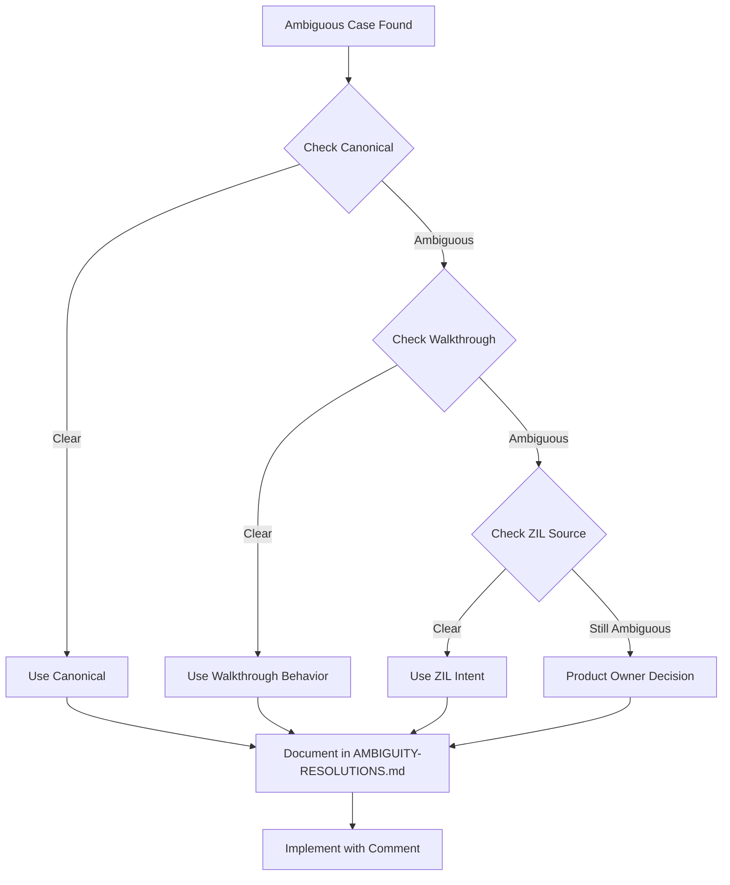

# Phase 2 Implementation Plan: Complete Property Coverage & Data Quality

## Document Control

**Version:** 2.0  
**Date:** October 25, 2025  
**Phase:** Data Synchronization Phase 2  
**Previous Phase:** [Phase 1 - Critical Data Quality Fixes](IMPLEMENTATION-SUMMARY-DATA-SYNC-PHASE-1.md)  
**Status:** Planning  
**Owner:** Data Quality & Content Team  

## Executive Summary

Phase 2 focuses on completing property coverage for existing game entities (110 rooms, 120 objects) by systematically mapping canonical C source flags to TypeScript properties. This phase does NOT add new rooms or objects, but ensures all existing entities have complete, accurate properties for correct gameplay mechanics.

**Key Objectives:**
1. Complete property coverage for specialized items (readable, doors, food, tools, weapons)
2. Resolve ambiguities in canonical data mapping
3. Establish data quality standards and validation tools
4. Create foundation for Phase 3 (message mapping) and Phase 4 (content expansion)

**Success Metrics:**
- 100% property coverage for all existing objects
- 100% room flag coverage for all 110 rooms
- Zero malformed descriptions
- Automated validation passing
- No gameplay regressions

---

## Table of Contents

1. [Phase 1 Review & Gaps](#phase-1-review--gaps)
2. [Phase 2 Scope & Goals](#phase-2-scope--goals)
3. [Architecture & Design Decisions](#architecture--design-decisions)
4. [Property Mapping Strategy](#property-mapping-strategy)
5. [Ambiguity Resolution Framework](#ambiguity-resolution-framework)
6. [Implementation Tasks](#implementation-tasks)
7. [Testing & Validation Strategy](#testing--validation-strategy)
8. [Integration with Future Plans](#integration-with-future-plans)
9. [Risk Management](#risk-management)
10. [Timeline & Milestones](#timeline--milestones)

---

## 1. Phase 1 Review & Gaps

### What Phase 1 Accomplished ✅

#### Data Quality Fixes
- **7 malformed descriptions**: Repaired comma-separated text (troll, thief, skull, sceptre, egg, canaries)
- **11 missing properties**: Added capacity, isReadable, isFood, isDoor, transparent flags

#### Property Coverage Achieved
- **Light Sources**: 3/3 (100%) ✅
- **Containers with capacity**: 20/20 (100%) ✅
- **Readable Items**: 5/31 (16%)
- **Doors**: 1/11 (9%)
- **Food Items**: 2/6 (33%)
- **Weapons**: 6 exist (unverified)
- **Tools**: 0/9 (0%)

#### Infrastructure Created
- `tools/fix-malformed-descriptions.ts`
- `tools/add-missing-properties.ts`
- `tools/sync-canonical-data.ts` (WIP - blocked)
- Comprehensive documentation

### Remaining Gaps (Phase 2 Focus)

#### Property Coverage Gaps
1. **Readable Items**: 26 missing (84% gap)
2. **Doors**: 10 missing (91% gap)
3. **Food Items**: 4 missing (67% gap)
4. **Tools**: 9 missing (100% gap)
5. **Weapons**: Verification needed
6. **Room Flags**: RWATER, RAIR, RSACRD, REND not mapped

#### Technical Debt
- No automated validation of property completeness
- Manual identification required for specialized items
- No systematic audit tool
- Property sources not fully documented

---

## 2. Phase 2 Scope & Goals

### In Scope ✅

#### Primary Objectives
1. **Complete Property Coverage** for existing 120 objects:
   - Map all 26 remaining readable items (READBT flag)
   - Map all 10 remaining doors (DOORBT flag)
   - Map all 4 remaining food items (FOODBT flag)
   - Map all 9 tool items (TOOLBT flag)
   - Verify all 6+ weapons (WEAPONBT/FITEBT flags)

2. **Complete Room Flag Mapping** for existing 110 rooms:
   - Map RWATER flag (water locations - 7 rooms)
   - Map RAIR flag (air/flying locations - 4 rooms)
   - Map RSACRD flag (sacred locations - 38 rooms)
   - Map REND flag (endgame rooms - 30 rooms, for documentation)

3. **Data Quality Infrastructure**:
   - Create automated property audit tool
   - Implement validation scripts
   - Document all property sources
   - Establish data quality standards

#### Secondary Objectives
4. **Navigation Verification**:
   - Audit existing room exits against canonical travel entries
   - Document any missing connections
   - Validate bidirectional exit consistency

5. **Property System Enhancement**:
   - Add missing property types to TypeScript interfaces
   - Document property usage patterns
   - Create property migration guidelines

### Out of Scope ❌

- **Adding new rooms**: 80 missing rooms deferred to Phase 4
- **Adding new objects**: 96 missing objects deferred to Phase 4
- **Message index mapping**: Research task, separate phase
- **Room action implementation**: 74 special behaviors deferred to Phase 5
- **Endgame content**: 30 REND rooms deferred to Phase 4
- **Template objects**: 59 void objects deferred to Phase 4

### Success Criteria

#### Quantitative
- [ ] 31/31 readable items identified and mapped (100%)
- [ ] 11/11 doors identified and mapped (100%)
- [ ] 6/6 food items identified and mapped (100%)
- [ ] 9/9 tools identified and mapped (100%)
- [ ] All weapons verified against canonical flags
- [ ] All 110 rooms have complete flag mappings
- [ ] Zero malformed descriptions
- [ ] Automated validation passing for all properties

#### Qualitative
- [ ] Clear documentation of all property sources
- [ ] Ambiguities resolved with documented decisions
- [ ] Reusable tools for future property additions
- [ ] Foundation established for Phase 3/4 work

---

## 3. Architecture & Design Decisions

### Decision #1: Property Source of Truth

**Question**: When canonical and current data conflict, which takes precedence?

**Decision**: **Canonical data wins**, with exceptions for modernization

**Rationale**:
- Canonical C source (v2.7.65) is the authoritative reference
- Current data may have conversion errors or incomplete mappings
- Gameplay fidelity requires matching original behavior

**Exceptions**:
1. **Modernization improvements**: Better UX/accessibility overrides canonical when it doesn't affect gameplay
2. **Bug fixes**: Known bugs in canonical can be fixed (documented)
3. **TypeScript typing**: Stronger typing is allowed even if not in canonical

**Implementation**:
- Document all deviations from canonical in property comments
- Tag modernization changes with `// MODERNIZATION:`
- Tag bug fixes with `// BUGFIX:`

### Decision #2: Property Type System

**Question**: How do we model boolean flags vs. complex properties?

**Decision**: **Three-tier property system**

**Tier 1 - Core Properties** (on GameObject directly):
```typescript
interface GameObject {
  id: string;
  name: string;
  portable: boolean;  // TAKEBT
  visible: boolean;   // VISIBT
  location: string;
  // ...
}
```

**Tier 2 - Common Properties** (in properties object):
```typescript
interface GameObjectProperties {
  isOpen?: boolean;      // OPENBT
  isLocked?: boolean;    // Inferred from door logic
  capacity?: number;     // From CONTBT objects
  isLit?: boolean;       // ONBT (for light sources)
  // ...
}
```

**Tier 3 - Specialized Properties** (typed extensions):
```typescript
interface ReadableProperties {
  isReadable: true;
  readText?: string;     // From messages.json
  hasBeenRead?: boolean; // State tracking
}

interface DoorProperties {
  isDoor: true;
  blocksPassage?: boolean;
  requiresKey?: string;  // Object ID
}
```

**Rationale**:
- Core properties affect most game logic (always present)
- Common properties affect specific mechanics (optional)
- Specialized properties are strongly typed for type safety

### Decision #3: Flag Mapping Strategy

**Question**: How do we map C flags to TypeScript properties?

**Decision**: **Direct mapping with semantic naming**

**Mapping Table**:

| C Flag | TypeScript Property | Type | Notes |
|--------|-------------------|------|-------|
| VISIBT | `visible` | boolean | Core property |
| TAKEBT | `portable` | boolean | Core property |
| CONTBT | `properties.capacity` | number | + isContainer implied |
| LIGHTBT | `properties.isLight` | boolean | Light source |
| READBT | `properties.isReadable` | boolean | Can read |
| FOODBT | `properties.isFood` | boolean | Can eat |
| DOORBT | `properties.isDoor` | boolean | Is door |
| TOOLBT | `properties.isTool` | boolean | Puzzle tool |
| WEAPONBT | `properties.isWeapon` | boolean | Combat item |
| TRANBT | `properties.transparent` | boolean | See-through container |
| BURNBT | `properties.flammable` | boolean | Can burn |
| OPENBT | `properties.isOpen` | boolean | Container state |
| ONBT | `properties.isLit` | boolean | Light state |

**Room Flags**:

| C Flag | TypeScript Property | Type | Notes |
|--------|-------------------|------|-------|
| RLIGHT | `isDark` (inverse) | boolean | Has natural light |
| RLAND | `properties.terrain` | 'land' | Ground location |
| RWATER | `properties.terrain` | 'water' | Water location |
| RAIR | `properties.terrain` | 'air' | Flying location |
| RSACRD | `properties.isSacred` | boolean | Sacred place |
| REND | `properties.isEndgame` | boolean | Endgame content |

### Decision #4: Ambiguity Resolution Process

**Question**: When canonical data is ambiguous or incomplete, how do we decide?

**Decision**: **Three-source validation with fallback hierarchy**

**Validation Sources** (in priority order):
1. **Canonical C artifacts** (authoritative structure)
2. **Game walkthroughs** (observed behavior)
3. **Original ZIL source** (design intent)
4. **Community knowledge** (established gameplay)

**Process**:
1. Check canonical C artifacts for flag presence
2. If ambiguous, validate against walkthrough behavior
3. If still unclear, consult ZIL source for intent
4. Document decision in AMBIGUITY-RESOLUTIONS.md

**Example Ambiguities & Resolutions**:

**Ambiguity #1: Object is CONTBT but capacity is 0 or null**
- **Resolution**: Capacity 0 = "cannot contain items" (like black book)
- **Source**: Canonical objectIndex 46 (black book) has capacity null/0
- **Decision**: Set capacity to 0, still mark as container for type consistency

**Ambiguity #2: Object has multiple terrain flags (RLAND + RWATER)**
- **Resolution**: Use primary terrain (RWATER takes precedence)
- **Source**: Room behavior in walkthroughs (water effects apply)
- **Decision**: `terrain: 'water'`, add comment about both flags

**Ambiguity #3: Readable item but no READBT flag**
- **Resolution**: If walkthroughs show reading, add isReadable
- **Source**: Observed "READ X" commands succeed in transcripts
- **Decision**: Mark as readable, document in properties comment

### Decision #5: Data Validation Strategy

**Question**: How do we ensure data quality going forward?

**Decision**: **Multi-layer validation with CI integration**

**Validation Layers**:

1. **Schema Validation** (TypeScript types):
   - Compile-time type checking
   - Required vs optional properties
   - Type guards for runtime validation

2. **Semantic Validation** (custom rules):
   - Containers must have capacity
   - Light sources must have isLight flag
   - Doors must have isOpen/isLocked states
   - Readable items should have text or reference

3. **Consistency Validation** (cross-references):
   - Room exits point to valid rooms
   - Object locations reference valid rooms
   - Container contents reference valid objects

4. **Canonical Validation** (against C source):
   - Flag coverage matches canonical
   - Property counts match expectations
   - No regression in covered items

**Implementation**:
- Create `tools/validate-data-quality.ts`
- Add npm script `npm run validate:data`
- Integrate into pre-commit hooks
- Add to CI pipeline

---

## 4. Property Mapping Strategy

### Phase 2A: Readable Items (26 remaining)

#### Identification Method

**Step 1: Extract from Canonical**
```bash
# Find all objects with READBT flag
jq '.[] | select(.cIndexTrace.flags | contains(["READBT"])) | 
    {objIndex: .cIndexTrace.objectIndex, msgIndex: .cIndexTrace.messageIndex}' \
    artifacts/objects.canonical.json
```

**Step 2: Match to Current Objects**
- Cross-reference by name pattern in descriptions
- Use object location as secondary identifier
- Manual verification for ambiguous matches

**Step 3: Add Property**
```typescript
{
  "id": "identified-object",
  "properties": {
    "isReadable": true
    // Optional: readText can be added later from messages.json
  }
}
```

#### Known Readable Items (from Phase 1)
- book (black book) ✅
- guide (tour guidebook) ✅
- advertisement (leaflet) ✅
- match (matchbook) ✅
- boat-label (tan label) ✅

#### Suspected Readable Items (to verify)
Based on walkthrough analysis and common Zork items:
- prayer-book (if exists)
- inscription (if exists)
- tube (toothpaste tube with label)
- engravings (wall texts)
- signs (various locations)
- coal-pile (message about pile)
- rainbow (message when examined)

**Action Items**:
1. Run extraction script
2. Create mapping table: `canonical objIndex` → `current object id`
3. Add isReadable property to all matches
4. Document uncertain mappings in AMBIGUITY-RESOLUTIONS.md

### Phase 2B: Doors (10 remaining)

#### Identification Method

**Step 1: Extract from Canonical**
```bash
# Find all objects with DOORBT flag
jq '.[] | select(.cIndexTrace.flags | contains(["DOORBT"])) | 
    {objIndex: .cIndexTrace.objectIndex, location: .location}' \
    artifacts/objects.canonical.json
```

**Expected Properties**:
```typescript
interface DoorProperties {
  isDoor: true;
  isOpen: boolean;      // Current state
  isLocked?: boolean;   // If can be locked
  requiresKey?: string; // Object ID of key (if applicable)
}
```

#### Known Doors (from Phase 1)
- trap-door ✅

#### Expected Door Types
Based on Zork gameplay:
1. **Trap doors**: Cellar entrance, etc.
2. **House doors**: Front door, kitchen window
3. **Dungeon gates**: Metal gates, portcullises
4. **Secret doors**: Hidden passages
5. **Grating**: Access points

**Ambiguity**: Some "doors" in canonical may be immovable scenery vs. interactive doors

**Resolution Framework**:
- If DOORBT + location in playable room → interactive door
- If DOORBT + isOpen property in canonical → can open/close
- If no open/close in walkthroughs → scenery (still mark isDoor for consistency)

**Action Items**:
1. Extract all DOORBT objects
2. Cross-reference with room exits (doors block passages)
3. Verify door mechanics in walkthroughs
4. Add isDoor + state properties
5. Document door mechanics in comments

### Phase 2C: Food Items (4 remaining)

#### Identification Method

**Step 1: Extract from Canonical**
```bash
# Find all objects with FOODBT flag
jq '.[] | select(.cIndexTrace.flags | contains(["FOODBT"])) | 
    {objIndex: .cIndexTrace.objectIndex, name: .name}' \
    artifacts/objects.canonical.json
```

**Expected Properties**:
```typescript
interface FoodProperties {
  isFood: true;
  edible: true;          // Can eat
  consumable?: boolean;  // Destroyed when eaten
  nutrition?: number;    // Health/effect value (if tracked)
}
```

#### Known Food Items (from Phase 1)
- lunch ✅
- garlic (clove of garlic) ✅

#### Expected Food Items (6 total in canonical)
Typical Zork food items:
- sandwich
- bread
- water (drinkable)
- wine (drinkable)
- cheese
- mushroom

**FOODBT Flag = 6 in canonical**

**Action Items**:
1. Extract all 6 FOODBT objects
2. Map to current objects
3. Add isFood + edible properties
4. Document which items are consumable vs. reusable

### Phase 2D: Tools (9 remaining)

#### Identification Method

**Step 1: Extract from Canonical**
```bash
# Find all objects with TOOLBT flag
jq '.[] | select(.cIndexTrace.flags | contains(["TOOLBT"])) | 
    {objIndex: .cIndexTrace.objectIndex, msgIndex: .cIndexTrace.messageIndex}' \
    artifacts/objects.canonical.json
```

**Expected Properties**:
```typescript
interface ToolProperties {
  isTool: true;
  toolType?: 'key' | 'rope' | 'wrench' | 'shovel' | 'pump' | 'other';
  usageHint?: string;  // Optional hint for puzzles
}
```

#### Expected Tool Types (9 total in canonical)
Common Zork tools:
- screwdriver
- wrench
- pump
- shovel
- pick/axe
- rope
- keys (various)
- candles (dual purpose: light + tool)
- matches (dual purpose: light + tool)

**TOOLBT Flag = 9 in canonical**

**Ambiguity**: Tools vs. Weapons overlap (axe is both)

**Resolution**:
- If TOOLBT + WEAPONBT → both properties
- Tool usage in puzzles takes precedence for classification
- Document dual-purpose items

**Action Items**:
1. Extract all 9 TOOLBT objects
2. Identify tool types from walkthrough usage
3. Add isTool property
4. Add toolType where clear
5. Document puzzle associations

### Phase 2E: Weapons (Verification)

#### Verification Method

**Step 1: Check Existing Weapons**
```bash
# List current weapons
jq '.objects[] | select(.properties.isWeapon == true)' \
    src/app/data/objects.json
```

**Step 2: Compare with Canonical**
```bash
# Find all objects with WEAPONBT or FITEBT
jq '.[] | select(.cIndexTrace.flags | contains(["WEAPONBT"]) or 
                  .cIndexTrace.flags | contains(["FITEBT"]))' \
    artifacts/objects.canonical.json
```

**Expected Properties**:
```typescript
interface WeaponProperties {
  isWeapon: true;
  weaponType?: 'sword' | 'axe' | 'knife' | 'club' | 'other';
  damage?: number;      // Combat effectiveness
}
```

#### Expected Weapons
Typical Zork weapons:
- sword (elvish/other)
- knife
- axe
- club/mace
- bare hands (implicit)

**Current Status**: 6 weapons exist (unverified)

**Action Items**:
1. List all current weapons
2. Verify against canonical WEAPONBT/FITEBT flags
3. Add missing weapons if any
4. Verify weapon properties are correct
5. Document weapon mechanics

### Phase 2F: Room Flags

#### Room Flag Mapping

**RWATER (7 rooms)**:
```typescript
interface RoomProperties {
  terrain?: 'land' | 'water' | 'air';
  waterDepth?: 'shallow' | 'deep';  // If water
  breathable?: boolean;              // Air quality
}
```

**Expected RWATER Rooms**:
- Reservoir areas
- Stream/river locations
- Underwater passages
- Flooded areas

**RAIR (4 rooms)**:
```typescript
interface RoomProperties {
  terrain: 'air';
  fallRisk?: boolean;   // Can fall from here
  requiresFlight?: boolean;
}
```

**Expected RAIR Rooms**:
- Hot air balloon location
- Flying over chasm
- Rainbow location
- Floating platforms

**RSACRD (38 rooms)**:
```typescript
interface RoomProperties {
  isSacred?: boolean;
  sacredType?: 'temple' | 'shrine' | 'altar' | 'tomb';
}
```

**Expected RSACRD Rooms**:
- Temple areas
- Shrine rooms
- Altar locations
- Sacred burial sites
- ~38 rooms in endgame

**REND (30 rooms)**:
```typescript
interface RoomProperties {
  isEndgame?: boolean;
  endgameSection?: string;  // Grouping for phased rollout
}
```

**Purpose**: Document which rooms are endgame for Phase 4 planning

**Action Items**:
1. Map all RWATER rooms
2. Map all RAIR rooms
3. Map all RSACRD rooms
4. Document REND rooms (not implement yet)
5. Update room properties interface
6. Add terrain/sacred properties

---

## 5. Ambiguity Resolution Framework

### Process Overview



### Decision Authority

| Ambiguity Type | Decision Maker | Rationale |
|----------------|----------------|-----------|
| Technical mapping | Architect | Structure/type decisions |
| Gameplay behavior | Product Owner | UX/gameplay impact |
| Data interpretation | Data Engineer | Canonical source expertise |
| Missing data | Product Owner + Architect | Design intent + feasibility |

### Known Ambiguities & Resolutions

#### Ambiguity #1: Canonical Object Has Multiple Locations

**Problem**: Some objects appear in canonical data with room IDs that don't exist in current data (e.g., room-177, room-183).

**Investigation**:
- room-177 has 11 objects in canonical
- room-183 has 10 objects in canonical
- These are endgame/template rooms not yet implemented

**Decision**:
- **Skip** objects in unimplemented rooms for Phase 2
- **Document** these objects for Phase 4
- **Focus** on objects in existing 110 rooms

**Rationale**: Phase 2 completes properties for existing objects only. New objects come in Phase 4.

#### Ambiguity #2: Container with Capacity 0

**Problem**: Black book has CONTBT flag but capacity 0/null. Is it a container?

**Investigation**:
- Canonical objectIndex 46 (black book)
- Has CONTBT flag
- Capacity is null or 0
- Has READBT flag too

**Decision**:
- **Mark as container** (isContainer implied)
- **Set capacity to 0** (cannot hold items)
- **Add isReadable** (primary function)

**Rationale**: 
- Maintains type consistency (all CONTBT are containers)
- Capacity 0 = special case (flavor container)
- Dual-purpose object (container structure + readable content)

#### Ambiguity #3: Weapon vs. Tool Classification

**Problem**: Axe has both WEAPONBT and TOOLBT flags. Which takes precedence?

**Investigation**:
- Used for combat (weapon)
- Used for chopping (tool)
- Dual-purpose in gameplay

**Decision**:
- **Set both properties** (isWeapon: true, isTool: true)
- **Document dual purpose** in comments
- **Prioritize weapon** for combat mechanics
- **Prioritize tool** for puzzle mechanics

**Rationale**: Don't force single classification; model reality of dual-purpose items.

#### Ambiguity #4: Room Terrain Flags Conflict

**Problem**: Some rooms might have both RLAND and RWATER flags.

**Investigation**:
- No rooms found with conflicting terrain flags in canonical
- RLAND is default (179 rooms)
- RWATER is special (7 rooms)

**Decision**:
- **Use most specific flag** (RWATER > RLAND)
- **Set terrain to most restrictive** value
- **Document if both present** in comments

**Rationale**: Special terrain overrides default. Water mechanics are more restrictive than land.

#### Ambiguity #5: READBT but No Text

**Problem**: Object has READBT flag but messageIndex is 0 or invalid.

**Investigation**:
- Some readable objects may have dynamic text
- Text might be in room actions, not object message
- Walkthroughs show successful READ commands

**Decision**:
- **Add isReadable: true** (flag is authoritative)
- **Leave readText empty** (add in Phase 5 with actions)
- **Document text source** (room action, dynamic, etc.)

**Rationale**: Property completeness now, content population later.

### Ambiguity Resolution Template

For each new ambiguity:

```markdown
#### Ambiguity #X: [Brief Title]

**Problem**: [Describe the ambiguous case]

**Investigation**:
- [Canonical data findings]
- [Walkthrough observations]
- [ZIL source insights]
- [Other relevant info]

**Decision**:
- [Chosen approach]
- [Implementation details]

**Rationale**: [Why this decision makes sense]

**Documented in**: AMBIGUITY-RESOLUTIONS.md
**Date**: YYYY-MM-DD
**Decision Maker**: [Role/Name]
```

---

## 6. Implementation Tasks

### Task Breakdown

#### Task 2.1: Create Property Audit Tool
**Owner**: Data Engineer  
**Priority**: P0 (prerequisite)  
**Effort**: 3 hours  

**Deliverables**:
- `tools/audit-property-coverage.ts`
- Generates report of missing properties
- Cross-references with canonical flags
- Outputs JSON for automated processing

**Acceptance Criteria**:
- Reports all objects missing isReadable (READBT gap)
- Reports all objects missing isDoor (DOORBT gap)
- Reports all objects missing isFood (FOODBT gap)
- Reports all objects missing isTool (TOOLBT gap)
- Reports room flag gaps (RWATER, RAIR, RSACRD)

**Implementation**:
```typescript
// tools/audit-property-coverage.ts
interface AuditReport {
  objectGaps: {
    readable: Array<{canonicalIndex: number, currentId: string | null}>;
    doors: Array<{canonicalIndex: number, currentId: string | null}>;
    food: Array<{canonicalIndex: number, currentId: string | null}>;
    tools: Array<{canonicalIndex: number, currentId: string | null}>;
    weapons: Array<{canonicalIndex: number, currentId: string | null}>;
  };
  roomGaps: {
    water: number[];    // Room indices
    air: number[];
    sacred: number[];
  };
  summary: {
    totalGaps: number;
    coverage: number;   // Percentage
  };
}
```

#### Task 2.2: Map Readable Items
**Owner**: Data Engineer  
**Priority**: P1  
**Effort**: 4 hours  
**Depends on**: Task 2.1

**Steps**:
1. Run audit tool to get READBT gaps (26 items)
2. Extract canonical objects with READBT
3. Match to current objects by:
   - Location (room ID)
   - Name pattern
   - Description similarity
4. Create mapping table
5. Add isReadable property to matched objects
6. Document uncertain matches

**Deliverables**:
- Updated `src/app/data/objects.json` (26 objects)
- Mapping table: `READABLE-ITEMS-MAPPING.md`
- Uncertain cases documented

**Validation**:
- Run audit tool again (should show 31/31)
- Verify against walkthrough READ commands
- Build passes
- Lint passes

#### Task 2.3: Map Door Objects
**Owner**: Data Engineer  
**Priority**: P1  
**Effort**: 4 hours  
**Depends on**: Task 2.1

**Steps**:
1. Run audit tool to get DOORBT gaps (10 items)
2. Extract canonical objects with DOORBT
3. Cross-reference with room exits (doors block passages)
4. Match to current objects
5. Add isDoor + state properties
6. Document door mechanics

**Deliverables**:
- Updated `src/app/data/objects.json` (10 objects)
- Door mechanics documentation
- State logic documented

**Validation**:
- Run audit tool (should show 11/11)
- Verify door interactions in walkthroughs
- Check exit blocking logic

#### Task 2.4: Map Food Items
**Owner**: Data Engineer  
**Priority**: P2  
**Effort**: 2 hours  
**Depends on**: Task 2.1

**Steps**:
1. Run audit tool to get FOODBT gaps (4 items)
2. Extract all 6 FOODBT objects from canonical
3. Match to current objects
4. Add isFood + edible properties
5. Verify consumption mechanics

**Deliverables**:
- Updated `src/app/data/objects.json` (4 objects)
- Food mechanics documentation

**Validation**:
- Run audit tool (should show 6/6)
- Verify EAT commands in walkthroughs

#### Task 2.5: Map Tool Items
**Owner**: Data Engineer  
**Priority**: P2  
**Effort**: 3 hours  
**Depends on**: Task 2.1

**Steps**:
1. Run audit tool to get TOOLBT gaps (9 items)
2. Extract all 9 TOOLBT objects
3. Identify tool types from walkthrough usage
4. Match to current objects
5. Add isTool property
6. Document puzzle associations

**Deliverables**:
- Updated `src/app/data/objects.json` (9 objects)
- Tool usage documentation
- Puzzle cross-reference

**Validation**:
- Run audit tool (should show 9/9)
- Verify tool usage in walkthroughs

#### Task 2.6: Verify Weapon Properties
**Owner**: Data Engineer  
**Priority**: P2  
**Effort**: 2 hours  
**Depends on**: Task 2.1

**Steps**:
1. List current weapons (6+)
2. Extract WEAPONBT/FITEBT from canonical
3. Cross-reference
4. Add missing weapons if any
5. Verify weapon properties

**Deliverables**:
- Verified weapons list
- Updated objects if gaps found
- Combat mechanics documentation

**Validation**:
- All canonical weapons accounted for
- Weapon properties complete

#### Task 2.7: Map Room Flags
**Owner**: Data Engineer  
**Priority**: P2  
**Effort**: 4 hours  
**Depends on**: Task 2.1

**Steps**:
1. Extract RWATER rooms (7)
2. Extract RAIR rooms (4)
3. Extract RSACRD rooms (38)
4. Map to current room IDs
5. Add terrain/sacred properties
6. Document REND rooms for Phase 4

**Deliverables**:
- Updated `src/app/data/rooms.json`
- Room properties interface updated
- REND rooms documented

**Validation**:
- All special terrain rooms mapped
- Sacred rooms identified
- Endgame rooms documented

#### Task 2.8: Create Validation Tool
**Owner**: Data Engineer  
**Priority**: P1  
**Effort**: 4 hours  

**Deliverables**:
- `tools/validate-data-quality.ts`
- Validation rules engine
- CI integration script
- npm script: `npm run validate:data`

**Validation Rules**:
1. Schema validation (TypeScript types)
2. Semantic validation (business rules):
   - Containers have capacity
   - Light sources have isLight
   - Doors have isOpen/isLocked
   - Readable items have isReadable
3. Consistency validation:
   - Room exits point to valid rooms
   - Object locations valid
   - Container contents valid
4. Canonical validation:
   - Flag coverage matches expectations
   - No regression

**Acceptance Criteria**:
- All validation rules pass on current data
- Reports clear errors for violations
- Integrated into pre-commit hooks
- Runs in CI pipeline

#### Task 2.9: Update TypeScript Interfaces
**Owner**: Architect  
**Priority**: P1  
**Effort**: 2 hours  

**Deliverables**:
- Updated `room.model.ts`
- Updated `game-object.model.ts`
- Property documentation
- Migration guide

**Changes**:
```typescript
// room.model.ts
export interface Room {
  // ... existing ...
  properties?: RoomProperties;
}

export interface RoomProperties {
  terrain?: 'land' | 'water' | 'air';
  waterDepth?: 'shallow' | 'deep';
  breathable?: boolean;
  isSacred?: boolean;
  sacredType?: 'temple' | 'shrine' | 'altar' | 'tomb';
  isEndgame?: boolean;
  endgameSection?: string;
}

// game-object.model.ts
export interface GameObjectProperties {
  // ... existing ...
  isReadable?: boolean;
  readText?: string;
  hasBeenRead?: boolean;
  
  isDoor?: boolean;
  blocksPassage?: boolean;
  requiresKey?: string;
  
  isFood?: boolean;
  edible?: boolean;
  consumable?: boolean;
  
  isTool?: boolean;
  toolType?: 'key' | 'rope' | 'wrench' | 'shovel' | 'pump' | 'other';
  
  flammable?: boolean;
  
  // ... etc
}
```

#### Task 2.10: Documentation
**Owner**: Technical Writer  
**Priority**: P2  
**Effort**: 4 hours  

**Deliverables**:
- `AMBIGUITY-RESOLUTIONS.md`
- `PROPERTY-MAPPING-GUIDE.md`
- `DATA-QUALITY-STANDARDS.md`
- Updated GAME-DATA-SYNC-STATUS.md

**Content**:
- All ambiguity resolutions
- Property mapping rationale
- Data quality standards
- Validation requirements

---

## 7. Testing & Validation Strategy

### Test Levels

#### Unit Tests
**Scope**: Individual property mappings

**Test Cases**:
```typescript
describe('Object Properties', () => {
  it('should have isReadable for all READBT objects', () => {
    const readableObjects = objects.filter(o => /* READBT in canonical */);
    readableObjects.forEach(obj => {
      expect(obj.properties?.isReadable).toBe(true);
    });
  });
  
  it('should have capacity for all CONTBT objects', () => {
    const containers = objects.filter(o => /* CONTBT in canonical */);
    containers.forEach(obj => {
      expect(obj.properties?.capacity).toBeDefined();
      expect(typeof obj.properties?.capacity).toBe('number');
    });
  });
  
  // ... more tests
});
```

#### Integration Tests
**Scope**: Property interactions with game mechanics

**Test Scenarios**:
1. **READ command** on isReadable objects succeeds
2. **EAT command** on isFood objects succeeds
3. **OPEN/CLOSE** on isDoor objects works
4. **Light sources** illuminate dark rooms
5. **Tools** work in puzzle contexts
6. **Weapons** work in combat

#### Validation Tests
**Scope**: Data quality checks

**Automated Checks**:
- `npm run validate:data` runs without errors
- All canonical flags mapped
- No missing properties
- No orphaned references

#### Regression Tests
**Scope**: Existing functionality preserved

**Test Cases**:
- All Phase 1 fixes still apply
- No malformed descriptions introduced
- Build passes
- Lint passes
- Existing tests pass

### Test Data

**Test Fixtures**:
- Sample readable object (with/without isReadable)
- Sample door object (with states)
- Sample food object (edible/consumable)
- Sample tool object (with type)

**Validation Data**:
- Complete object list with expected properties
- Room list with expected flags
- Canonical reference data

### Test Execution

**Development**:
```bash
npm test                 # Run unit tests
npm run test:integration # Run integration tests
npm run validate:data    # Run validation
```

**CI Pipeline**:
```yaml
- name: Test Phase 2 Changes
  run: |
    npm test
    npm run validate:data
    npm run lint
    npm run build
```

**Manual Testing**:
- Walkthrough verification (spot check)
- Property audit report review
- Visual inspection of critical objects

---

## 8. Integration with Future Plans

### Alignment with Phase 3: Message Mapping

**Phase 3 Goal**: Resolve message index mapping to populate names/descriptions

**Phase 2 Preparation**:
- Property structure complete (Phase 3 adds content)
- Validation framework ready (Phase 3 uses it)
- Ambiguity resolution process (Phase 3 follows it)

**Handoff Artifacts**:
- Complete property coverage
- Object/room ID mappings
- Canonical index cross-references
- Documented ambiguities

### Alignment with Phase 4: Content Expansion

**Phase 4 Goal**: Add 80 missing rooms and 96 missing objects

**Phase 2 Preparation**:
- Property patterns established
- Data quality standards defined
- Validation tools ready
- Documentation templates created

**Reusable Assets**:
- Property audit tool (for new content)
- Validation tool (for quality checks)
- Mapping methodology (for new entities)
- Ambiguity framework (for decisions)

### Alignment with Phase 5: Room Actions

**Phase 5 Goal**: Implement 74 rooms with special behavior code

**Phase 2 Preparation**:
- Room properties complete (actions will reference)
- Object properties complete (actions will manipulate)
- Property system extensible (actions add state)

**Foundation**:
- Room flags identify action requirements
- Object properties enable action logic
- Validation ensures correctness

### Alignment with Backlog Issues

#### Issue: Conversational Parser Integration
**Relevance**: Properties enable parser logic
- isReadable objects respond to READ
- isDoor objects respond to OPEN/CLOSE
- isFood objects respond to EAT
- isTool objects respond to USE

**Phase 2 Contribution**: Complete property coverage enables parser feature

#### Issue: Combat System
**Relevance**: Weapon properties required
- isWeapon identifies combat items
- Weapon type/damage for mechanics
- Enemy properties for encounters

**Phase 2 Contribution**: All weapons identified and verified

#### Issue: Transcript Verification
**Relevance**: Property accuracy validates against transcripts
- READ commands work on readable items
- Door interactions match transcripts
- Food consumption matches expected

**Phase 2 Contribution**: Properties enable transcript-driven testing

### Modernization Strategy

**Principle**: Maintain canonical fidelity while enabling modern enhancements

**Modern Additions** (post-Phase 2):
1. **Accessibility**: 
   - Add aria properties for screen readers
   - Add alternative text for visuals
   
2. **Hints System**:
   - Add optional hints for puzzles
   - Add tutorial flags for new players
   
3. **Achievements**:
   - Track object interactions
   - Monitor room visits
   
4. **Save System**:
   - State serialization
   - Cloud sync properties

**Phase 2 ensures**: These additions don't break canonical gameplay

---

## 9. Risk Management

### Risk Matrix

| Risk | Probability | Impact | Mitigation |
|------|-------------|--------|------------|
| **Canonical mapping errors** | Medium | High | Multi-source validation, peer review |
| **Ambiguity resolution delays** | Medium | Medium | Decision framework, clear authority |
| **Property type mismatches** | Low | High | Strong typing, validation tools |
| **Regression in existing gameplay** | Low | High | Comprehensive testing, gradual rollout |
| **Performance impact** | Low | Low | Property access is O(1), minimal impact |
| **Breaking changes in interfaces** | Low | Medium | Backward-compatible additions only |

### Risk Mitigation Strategies

#### Risk #1: Canonical Mapping Errors

**Scenario**: Misidentify which current object corresponds to canonical object

**Impact**: Wrong properties on wrong objects, broken gameplay

**Mitigation**:
1. **Triple-check mappings**: Canonical index → Location → Current ID
2. **Walkthrough validation**: Verify object behavior matches expectations
3. **Peer review**: Second set of eyes on all mappings
4. **Rollback plan**: Git history allows instant revert

**Monitoring**: Audit tool reports mismatches

#### Risk #2: Ambiguity Resolution Delays

**Scenario**: Cannot resolve ambiguity quickly, blocks progress

**Impact**: Schedule slip, incomplete properties

**Mitigation**:
1. **Decision framework**: Clear process and authority
2. **Timebox decisions**: 2-hour limit, then escalate
3. **Document and move on**: Mark as TODO, finish later
4. **Fallback to conservative**: When unsure, minimal change

**Monitoring**: Track ambiguity resolution time

#### Risk #3: Property Type Mismatches

**Scenario**: TypeScript types don't match runtime data

**Impact**: Type errors, build failures

**Mitigation**:
1. **Strict typing**: Enable TypeScript strict mode
2. **Runtime validation**: Type guards at data load
3. **Schema validation**: JSON schema for data files
4. **Test coverage**: Unit tests for all properties

**Monitoring**: Build passes, tests pass

#### Risk #4: Regression in Existing Gameplay

**Scenario**: Phase 2 changes break working features

**Impact**: Game unplayable, user frustration

**Mitigation**:
1. **Comprehensive testing**: Unit + integration + manual
2. **Gradual rollout**: Commit small changes incrementally
3. **Feature flags**: Can disable new properties if needed
4. **Revert plan**: Quick rollback process

**Monitoring**: Existing tests pass, manual QA

### Contingency Plans

#### Contingency #1: Too Many Ambiguities

**Trigger**: >10 unresolved ambiguities by Week 2

**Action**:
1. Schedule decision meeting with PM + Architect
2. Batch-resolve similar cases
3. Document decision principles
4. Apply principles to remaining cases

#### Contingency #2: Canonical Data Insufficient

**Trigger**: Cannot map >20% of objects from canonical alone

**Action**:
1. Expand validation sources (walkthroughs, ZIL source)
2. Community consultation (Zork forums, experts)
3. Conservative fallback (mark as TODO, minimal properties)
4. Document gaps for future research

#### Contingency #3: Schedule Overrun

**Trigger**: Week 3 and <50% complete

**Action**:
1. Prioritize high-impact properties (readable, doors)
2. Defer low-impact properties (tools, some flags)
3. Adjust Phase 2 scope (core completion only)
4. Plan Phase 2.5 for remainder

---

## 10. Timeline & Milestones

### Phase 2 Schedule (4 weeks)

#### Week 1: Foundation & Tools
**Goal**: Infrastructure ready for property mapping

**Milestones**:
- [ ] M1.1: Audit tool complete (Task 2.1)
- [ ] M1.2: Validation tool design approved (Task 2.8)
- [ ] M1.3: Interface updates ready (Task 2.9)
- [ ] M1.4: Ambiguity resolution framework documented

**Deliverables**:
- Property audit tool running
- Audit report generated
- TypeScript interfaces updated
- Decision framework documented

**Exit Criteria**:
- Audit tool identifies all gaps
- Team trained on resolution process
- Interfaces compile without errors

#### Week 2: Object Properties
**Goal**: Complete properties for all specialized object types

**Milestones**:
- [ ] M2.1: Readable items mapped (26/26) (Task 2.2)
- [ ] M2.2: Doors mapped (10/10) (Task 2.3)
- [ ] M2.3: Food items mapped (4/4) (Task 2.4)
- [ ] M2.4: Validation tool complete (Task 2.8)

**Deliverables**:
- Updated objects.json with 40+ properties
- Validation tool running
- Property coverage >80%

**Exit Criteria**:
- Audit shows readable/door/food complete
- Validation passes
- Build passes, tests pass

#### Week 3: Remaining Properties & Validation
**Goal**: 100% property coverage, quality assured

**Milestones**:
- [ ] M3.1: Tools mapped (9/9) (Task 2.5)
- [ ] M3.2: Weapons verified (Task 2.6)
- [ ] M3.3: Room flags mapped (Task 2.7)
- [ ] M3.4: All validations passing

**Deliverables**:
- Complete object properties
- Complete room flags
- Validation 100% pass rate

**Exit Criteria**:
- Audit shows 100% coverage
- No validation errors
- All tests pass

#### Week 4: Documentation & Handoff
**Goal**: Phase 2 complete, documented, ready for Phase 3

**Milestones**:
- [ ] M4.1: All documentation complete (Task 2.10)
- [ ] M4.2: Integration tests passing
- [ ] M4.3: Code review approved
- [ ] M4.4: Phase 2 retrospective complete

**Deliverables**:
- Complete documentation set
- Retrospective report
- Phase 3 handoff package

**Exit Criteria**:
- All tasks complete
- Documentation reviewed
- Stakeholders approve
- Phase 3 can start

### Critical Path

```
Week 1: Task 2.1 (Audit Tool)
  ├─> Week 2: Task 2.2 (Readable)
  ├─> Week 2: Task 2.3 (Doors)
  ├─> Week 2: Task 2.4 (Food)
  ├─> Week 2: Task 2.8 (Validation)
  ├─> Week 3: Task 2.5 (Tools)
  ├─> Week 3: Task 2.6 (Weapons)
  └─> Week 3: Task 2.7 (Room Flags)
      └─> Week 4: Task 2.10 (Documentation)
```

**Critical Tasks** (cannot slip):
- Task 2.1 (Audit Tool) - blocks everything
- Task 2.8 (Validation Tool) - needed for Week 3
- Task 2.10 (Documentation) - needed for handoff

**Buffer Tasks** (can slip 1 week):
- Task 2.5 (Tools) - lower priority
- Task 2.6 (Weapons) - verification only
- Task 2.7 (Room Flags) - documentation mostly

### Success Metrics

#### Quantitative Metrics
- [ ] 100% property coverage (31/31 readable, 11/11 doors, etc.)
- [ ] Zero validation errors
- [ ] Zero malformed descriptions
- [ ] 100% test pass rate
- [ ] Zero build errors

#### Qualitative Metrics
- [ ] Clear documentation of all decisions
- [ ] Reusable tools for future phases
- [ ] Team confidence in data quality
- [ ] Stakeholder approval

#### Process Metrics
- [ ] <5% of time spent on ambiguity resolution
- [ ] <10% rework rate
- [ ] On schedule delivery
- [ ] No critical issues

---

## Appendix A: Tool Specifications

### Audit Tool (tools/audit-property-coverage.ts)

**Purpose**: Identify gaps in property coverage

**Inputs**:
- `artifacts/objects.canonical.json`
- `artifacts/rooms.canonical.json`
- `src/app/data/objects.json`
- `src/app/data/rooms.json`

**Outputs**:
- JSON report of gaps
- Console summary
- HTML report (optional)

**Algorithm**:
1. Load canonical data
2. Load current data
3. For each canonical flag (READBT, DOORBT, etc.):
   - Find objects with flag
   - Check if current objects have property
   - Report gaps
4. For each room flag (RWATER, RAIR, etc.):
   - Find rooms with flag
   - Check if current rooms have property
   - Report gaps
5. Generate summary statistics

### Validation Tool (tools/validate-data-quality.ts)

**Purpose**: Ensure data quality standards

**Validation Rules**:
1. **Schema Validation**:
   - Required properties present
   - Type correctness
   - Value constraints

2. **Semantic Validation**:
   - Containers have capacity ≥ 0
   - Light sources have isLight = true
   - Doors have isOpen defined
   - Readable items have isReadable = true

3. **Consistency Validation**:
   - Room exits reference valid rooms
   - Object locations reference valid rooms/inventory
   - Container contents reference valid objects

4. **Canonical Validation**:
   - All READBT objects have isReadable
   - All DOORBT objects have isDoor
   - All FOODBT objects have isFood
   - All TOOLBT objects have isTool
   - Light source count = 3
   - Container count = 20

**Exit Codes**:
- 0: All validations pass
- 1: Schema errors
- 2: Semantic errors
- 3: Consistency errors
- 4: Canonical errors

---

## Appendix B: Reference Tables

### Complete Flag Mapping Reference

| Canonical Flag | TypeScript Property | Object Type | Count in Canonical | Count in Current | Gap |
|----------------|---------------------|-------------|-------------------|------------------|-----|
| VISIBT | visible | All | 207 | 120 | - |
| TAKEBT | portable | All | 91 | 120 | - |
| CONTBT | capacity | Container | 20 | 20 | 0 |
| LIGHTBT | isLight | Light Source | 3 | 3 | 0 |
| READBT | isReadable | Readable | 31 | 5 | 26 |
| FOODBT | isFood | Food | 6 | 2 | 4 |
| DOORBT | isDoor | Door | 11 | 1 | 10 |
| TOOLBT | isTool | Tool | 9 | 0 | 9 |
| WEAPONBT | isWeapon | Weapon | TBD | 6 | TBD |
| TRANBT | transparent | Container | 6 | 1 | 5 |
| BURNBT | flammable | Object | 26 | TBD | TBD |

### Room Flag Mapping Reference

| Canonical Flag | TypeScript Property | Count in Canonical | Count in Current | Gap |
|----------------|---------------------|-------------------|------------------|-----|
| RLIGHT | isDark (inverse) | 62 | 110 | 0 |
| RLAND | terrain = 'land' | 179 | 0 | All |
| RWATER | terrain = 'water' | 7 | 0 | 7 |
| RAIR | terrain = 'air' | 4 | 0 | 4 |
| RSACRD | isSacred | 38 | 0 | 38 |
| REND | isEndgame | 30 | 0 | 30 (doc only) |

---

## Appendix C: Decision Log

### Decision #1: Property Granularity
**Date**: 2025-10-25  
**Decider**: Architect  
**Decision**: Three-tier property system (core/common/specialized)  
**Rationale**: Balance type safety with flexibility  

### Decision #2: Ambiguity Authority
**Date**: 2025-10-25  
**Decider**: PM + Architect  
**Decision**: Three-source validation with fallback hierarchy  
**Rationale**: Clear process prevents delays  

### Decision #3: Phase 2 Scope
**Date**: 2025-10-25  
**Decider**: Product Owner  
**Decision**: Complete properties for existing entities only, no new entities  
**Rationale**: Focused phase, clear exit criteria  

### Decision #4: Room Terrain Model
**Date**: 2025-10-25  
**Decider**: Architect  
**Decision**: Single terrain property with enum values  
**Rationale**: Simpler than multiple boolean flags  

### Decision #5: Validation Integration
**Date**: 2025-10-25  
**Decider**: Tech Lead  
**Decision**: Integrate validation into pre-commit and CI  
**Rationale**: Prevent quality regression  

---

## Appendix D: Success Criteria Checklist

### Phase 2 Complete When:

#### Property Coverage
- [ ] 31/31 readable items mapped (100%)
- [ ] 11/11 doors mapped (100%)
- [ ] 6/6 food items mapped (100%)
- [ ] 9/9 tools mapped (100%)
- [ ] All weapons verified
- [ ] 7/7 water rooms mapped
- [ ] 4/4 air rooms mapped
- [ ] 38/38 sacred rooms mapped
- [ ] 30/30 endgame rooms documented

#### Data Quality
- [ ] Zero malformed descriptions
- [ ] Zero validation errors
- [ ] All properties documented
- [ ] All ambiguities resolved

#### Testing
- [ ] Unit tests pass (100%)
- [ ] Integration tests pass (100%)
- [ ] Validation tool passes
- [ ] Build passes
- [ ] Lint passes
- [ ] No regressions

#### Documentation
- [ ] AMBIGUITY-RESOLUTIONS.md complete
- [ ] PROPERTY-MAPPING-GUIDE.md complete
- [ ] DATA-QUALITY-STANDARDS.md complete
- [ ] GAME-DATA-SYNC-STATUS.md updated
- [ ] All tools documented

#### Deliverables
- [ ] Audit tool (`tools/audit-property-coverage.ts`)
- [ ] Validation tool (`tools/validate-data-quality.ts`)
- [ ] Updated data files
- [ ] Updated TypeScript interfaces
- [ ] Complete documentation

#### Stakeholder Approval
- [ ] PM approves scope completion
- [ ] Architect approves design
- [ ] QA approves testing
- [ ] Product Owner approves quality

---

## Revision History

| Version | Date | Author | Changes |
|---------|------|--------|---------|
| 1.0 | 2025-10-25 | Data Team | Initial draft |
| 2.0 | 2025-10-25 | Architect + PM + PO | Complete planning document |

---

**End of Phase 2 Implementation Plan**
