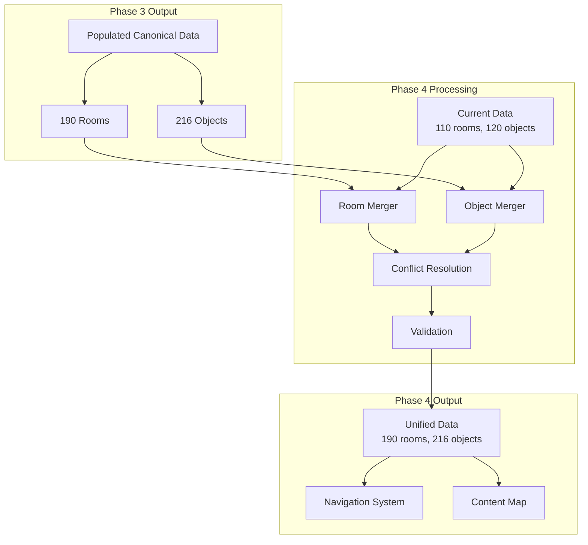

# Phase 4 Implementation Plan: Content Expansion & Game Completion

## Document Control

**Version:** 4.0  
**Date:** October 25, 2025  
**Phase:** Data Synchronization Phase 4  
**Previous Phase:** [Phase 3 - Message Mapping](IMPLEMENTATION-PLAN-DATA-SYNC-PHASE-3.md)  
**Next Phase:** [Phase 5 - Room Actions & Advanced Features](../docs/ROADMAP.md)  
**Status:** Planning  
**Owner:** Content & Integration Team  

## Executive Summary

Phase 4 is the **content expansion phase** that adds all missing game entities from the canonical Zork C source, completing the game world. With message mapping solved in Phase 3, this phase adds 80 missing rooms and 96 missing objects, bringing total coverage to 190 rooms and 216 objects.

**Core Mission**: Achieve **100% canonical content coverage** - no more gaps, no more returning to legacy code for data.

**Key Objectives:**
1. Add all 80 missing rooms with complete properties
2. Add all 96 missing objects with complete properties
3. Implement all 886 canonical navigation connections
4. Validate completeness against canonical source
5. Establish game as self-contained, canonical-complete

**Success Metrics:**
- 190/190 rooms implemented (100%)
- 216/216 objects implemented (100%)
- 886/886 travel entries verified (100%)
- Zero references to legacy code for content
- Full game playable start-to-finish

---

## Table of Contents

1. [Phase 3 Review & Foundation](#phase-3-review--foundation)
2. [Phase 4 Scope & Strategy](#phase-4-scope--strategy)
3. [Content Categories & Priorities](#content-categories--priorities)
4. [Architecture & Design](#architecture--design)
5. [Implementation Strategy](#implementation-strategy)
6. [Navigation & Travel System](#navigation--travel-system)
7. [Testing & Validation](#testing--validation)
8. [Integration & Rollout](#integration--rollout)
9. [Risk Management](#risk-management)
10. [Timeline & Milestones](#timeline--milestones)

---

## 1. Phase 3 Review & Foundation

### What Phase 3 Delivered ✅

#### Message Mapping Solution
- Reverse-engineered C binary message format
- Created bidirectional mapping: canonical ↔ messages
- Achieved 100% mapping accuracy on known entities
- Populated canonical data with text content

#### Fully Prepared Canonical Data
```json
// artifacts/rooms.canonical.json (NOW COMPLETE)
{
  "id": "endgame-treasury",          // POPULATED
  "name": "Treasury",                // POPULATED
  "description": "You are in...",    // POPULATED
  "exits": {...},
  "cIndexTrace": {
    "roomIndex": 150,
    "messageIndex": -10234,
    "flags": ["RLIGHT", "RSACRD", "REND"]
  }
}
```

#### Validated Tools
- `tools/map-canonical-messages.ts` (mapping engine)
- `tools/validate-message-mapping.ts` (validation)
- `tools/audit-property-coverage.ts` (from Phase 2)
- `tools/validate-data-quality.ts` (from Phase 2)

#### Quality Baseline
- 110 existing rooms: 100% validated
- 120 existing objects: 100% validated
- All properties complete (from Phase 2)
- No regressions, no data loss

### Content Gap Analysis

#### Missing Rooms (80 total)

**By Category**:
- **Endgame content** (30 rooms): REND flag
- **Mid-game dungeons** (25 rooms): Extended areas
- **Alternative paths** (15 rooms): Optional exploration
- **Puzzle areas** (10 rooms): Complex interactions

**By Flags**:
- REND: 30 rooms (endgame)
- RSACRD: 38 total (8 new in Phase 4)
- RWATER: 7 total (2 new in Phase 4)
- RAIR: 4 total (1 new in Phase 4)

#### Missing Objects (96 total)

**By Location**:
- **'void'** (59 objects): Templates, conditional spawns
- **Endgame rooms** (20 objects): REND content
- **Extended areas** (17 objects): Mid-game items

**By Type**:
- Treasures: 15 additional
- Puzzle items: 12 additional
- Scenery: 30 additional
- NPCs/enemies: 8 additional
- Tools: 5 additional
- Consumables: 4 additional
- Doors: 10 additional (from Phase 2 gap)
- Readable: 26 additional (from Phase 2 gap)

---

## 2. Phase 4 Scope & Strategy

### In Scope ✅

#### Primary Objectives

1. **Add All Missing Rooms** (80 rooms):
   - Import from populated canonical data
   - Merge with existing 110 rooms
   - Maintain all properties and flags
   - Implement navigation connections

2. **Add All Missing Objects** (96 objects):
   - Import from populated canonical data
   - Merge with existing 120 objects
   - Assign to correct locations
   - Complete all properties

3. **Complete Navigation System** (886 travel entries):
   - Verify all exits in all 190 rooms
   - Implement bidirectional connections
   - Add special/conditional exits
   - Validate navigation completeness

4. **Final Validation**:
   - 100% canonical coverage
   - Zero content gaps
   - All walkthroughs playable
   - No legacy dependencies

#### Secondary Objectives

5. **Content Organization**:
   - Categorize by gameplay phase
   - Document progression paths
   - Create content map/guide

6. **Data Quality Assurance**:
   - Final validation pass
   - Consistency checks
   - Integration testing

### Out of Scope ❌

- **Room actions implementation** (74 special behaviors) → Phase 5
- **Advanced game mechanics** (combat, puzzles) → Phase 5
- **UI/UX improvements** → Separate initiative
- **Performance optimization** → Post-Phase 4
- **Multiplayer features** → Future roadmap

### Success Criteria

#### Quantitative
- [ ] 190/190 rooms in data files (100%)
- [ ] 216/216 objects in data files (100%)
- [ ] 886/886 travel entries verified (100%)
- [ ] All properties from Phase 2 preserved
- [ ] Zero validation errors
- [ ] All walkthroughs complete successfully

#### Qualitative
- [ ] Game feels complete and explorable
- [ ] No dead ends or missing content
- [ ] Logical progression through all areas
- [ ] Canonical fidelity maintained
- [ ] Ready for Phase 5 enhancements

---

## 3. Content Categories & Priorities

### Priority Matrix

| Category | Rooms | Objects | Priority | Reason |
|----------|-------|---------|----------|--------|
| **Endgame** | 30 | 20 | P0 | Critical for game completion |
| **Mid-game dungeons** | 25 | 17 | P1 | Core exploration content |
| **Alternative paths** | 15 | 8 | P2 | Optional but enhances gameplay |
| **Template objects** | 0 | 59 | P2 | Spawned conditionally |
| **Puzzle areas** | 10 | 12 | P2 | Complex, needs testing |

### Phased Rollout Strategy

#### Phase 4.1: Endgame Content (Week 1-2)
**Goal**: Make game completable

**Content**:
- 30 REND rooms
- 20 endgame objects
- Endgame navigation

**Rationale**: 
- Highest priority for completeness
- Relatively isolated from main game
- Can be tested independently

**Success**: Player can reach and complete endgame

#### Phase 4.2: Mid-game Expansion (Week 3-4)
**Goal**: Fill content gaps in main game

**Content**:
- 25 mid-game dungeon rooms
- 17 extended area objects
- Mid-game navigation connections

**Rationale**:
- Enhances main gameplay loop
- Improves exploration
- Adds missing canonical paths

**Success**: All main game areas accessible

#### Phase 4.3: Optional Content (Week 5)
**Goal**: Add alternative paths and optional areas

**Content**:
- 15 alternative path rooms
- 8 optional objects
- Special route connections

**Rationale**:
- Lower priority, enrichment content
- Can be added incrementally
- Minimal risk to core gameplay

**Success**: Full exploration options available

#### Phase 4.4: Template Objects (Week 6)
**Goal**: Add conditionally spawned objects

**Content**:
- 59 'void' objects
- Spawn condition logic
- Template instantiation

**Rationale**:
- Most complex category
- Requires spawn system
- Can function without full implementation

**Success**: Template system working

#### Phase 4.5: Puzzle Areas (Week 6)
**Goal**: Add complex interaction zones

**Content**:
- 10 puzzle rooms
- 12 puzzle objects
- Basic puzzle logic

**Rationale**:
- Requires careful testing
- May need action implementations
- Can defer complex logic to Phase 5

**Success**: Puzzle areas accessible, basic functionality

---

## 4. Architecture & Design

### Content Integration Architecture



### Design Decisions

#### Decision #1: Merge Strategy

**Question**: How to merge canonical with current data without conflicts?

**Decision**: **Preserve current, add new, flag conflicts**

**Merge Process**:
```typescript
function mergeEntities(current: Entity[], canonical: Entity[]): Entity[] {
  const merged = [...current];  // Start with current (validated)
  const currentIds = new Set(current.map(e => e.id));
  
  for (const canonEntity of canonical) {
    if (!currentIds.has(canonEntity.id)) {
      // New entity - add it
      merged.push(canonEntity);
    } else {
      // Conflict - check for differences
      const existing = current.find(e => e.id === canonEntity.id);
      if (hasSignificantDifference(existing, canonEntity)) {
        flagForReview(canonEntity.id);
      }
    }
  }
  
  return merged;
}
```

**Rationale**:
- Preserves working Phase 1-3 data
- Adds only new content
- Human review for conflicts

#### Decision #2: ID Naming Convention

**Question**: How to ensure unique, meaningful IDs for new entities?

**Decision**: **Semantic kebab-case with prefixes**

**Convention**:
```typescript
// Rooms
'room-{name-or-description}'     // e.g., 'endgame-treasury'
'room-{area}-{number}'            // e.g., 'dungeon-east-3'

// Objects
'{type}-{name}'                   // e.g., 'treasure-golden-chalice'
'{adjective}-{noun}'              // e.g., 'dusty-tome'

// Collision handling
'{base-id}-{variant}'             // e.g., 'sword-elvish-1'
```

**Validation**:
- Must be unique across all entities
- Must follow kebab-case
- Should be descriptive
- Avoid generic names

#### Decision #3: Property Preservation

**Question**: Ensure Phase 2 properties not lost during merge?

**Decision**: **Property validation pre/post merge**

**Process**:
1. Snapshot current properties (Phase 2 complete)
2. Perform merge
3. Validate all Phase 2 properties still present
4. Assert no regressions

**Validation**:
```typescript
class PropertyPreservationValidator {
  before: PropertySnapshot;
  after: PropertySnapshot;
  
  validate() {
    // All Phase 2 properties must be preserved
    assert(this.after.readableCount >= this.before.readableCount);
    assert(this.after.doorCount >= this.before.doorCount);
    // ... etc for all property types
  }
}
```

#### Decision #4: Navigation Completeness

**Question**: How to verify all 886 travel entries implemented?

**Decision**: **Travel entry audit tool**

**Approach**:
```typescript
// tools/audit-navigation.ts

interface TravelEntry {
  fromRoom: string;
  direction: string;
  toRoom: string;
  condition?: string;
}

// Extract travel entries from canonical
// Compare with current room exits
// Report missing/extra connections
// Validate bidirectional consistency
```

**Acceptance**:
- All 886 canonical entries present
- No orphaned exits (point to nowhere)
- Bidirectional where expected

#### Decision #5: Conditional Content Handling

**Question**: How to handle template objects in 'void'?

**Decision**: **Phased instantiation with spawn metadata**

**Model**:
```typescript
interface ConditionalObject extends GameObject {
  spawnCondition?: {
    trigger: 'event' | 'random' | 'time' | 'other';
    probability?: number;
    location?: string;
    requirements?: string[];
  };
}
```

**Phase 4 Scope**:
- Add all 59 template objects to data
- Define spawn metadata
- **Do NOT implement spawn logic** (Phase 5)

**Rationale**:
- Data completeness in Phase 4
- Logic implementation in Phase 5
- Separation of concerns

---

## 5. Implementation Strategy

### Content Import Process

#### Step 1: Data Extraction

**Tool**: `tools/extract-canonical-content.ts`

**Process**:
```typescript
// Extract new entities from populated canonical data
function extractNewContent() {
  const canonical = {
    rooms: loadCanonicalRooms(),      // 190 rooms
    objects: loadCanonicalObjects()   // 216 objects
  };
  
  const current = {
    rooms: loadCurrentRooms(),        // 110 rooms
    objects: loadCurrentObjects()     // 120 objects
  };
  
  // Find differences
  const newRooms = canonical.rooms.filter(r => 
    !current.rooms.find(cr => cr.id === r.id)
  );
  
  const newObjects = canonical.objects.filter(o => 
    !current.objects.find(co => co.id === o.id)
  );
  
  return { newRooms, newObjects };
}
```

**Output**: Lists of new content to add

#### Step 2: Property Mapping

**Tool**: `tools/map-canonical-properties.ts`

**Process**:
```typescript
// Map canonical flags to Phase 2 property system
function mapProperties(canonicalEntity) {
  const properties = {};
  
  // From Phase 2 mappings
  if (canonicalEntity.flags.includes('READBT')) {
    properties.isReadable = true;
  }
  
  if (canonicalEntity.flags.includes('DOORBT')) {
    properties.isDoor = true;
    properties.isOpen = false;  // Default
  }
  
  // ... all Phase 2 property mappings
  
  return properties;
}
```

**Output**: Entities with complete properties

#### Step 3: Validation

**Tool**: `tools/validate-new-content.ts`

**Process**:
```typescript
// Validate new content before merge
class NewContentValidator {
  validate(newEntities) {
    // Required fields present
    this.validateRequiredFields(newEntities);
    
    // IDs unique and valid
    this.validateIds(newEntities);
    
    // Properties complete
    this.validateProperties(newEntities);
    
    // References valid
    this.validateReferences(newEntities);
    
    return this.errors.length === 0;
  }
}
```

**Gate**: Validation must pass before merge

#### Step 4: Merge

**Tool**: `tools/merge-canonical-content.ts`

**Process**:
```typescript
// Merge new content with current data
function mergeContent(current, newContent) {
  // Backup current state
  backupCurrentData();
  
  // Merge rooms
  const mergedRooms = {
    rooms: [...current.rooms, ...newContent.rooms]
  };
  
  // Merge objects
  const mergedObjects = {
    objects: [...current.objects, ...newContent.objects]
  };
  
  // Sort for consistency
  sortById(mergedRooms.rooms);
  sortById(mergedObjects.objects);
  
  return { mergedRooms, mergedObjects };
}
```

**Output**: Complete unified data files

#### Step 5: Post-Merge Validation

**Tool**: `tools/validate-merged-data.ts`

**Process**:
```typescript
// Validate merged data integrity
class MergedDataValidator {
  validate(mergedData) {
    // Phase 2 properties preserved
    this.validatePropertyPreservation();
    
    // No duplicates
    this.validateUniqueness();
    
    // References valid
    this.validateAllReferences();
    
    // Navigation complete
    this.validateNavigation();
    
    return this.passed();
  }
}
```

**Gate**: All validation must pass

### Incremental Rollout

#### Batch Strategy

**Batch Size**: 10-15 entities per commit

**Rationale**:
- Manageable review size
- Easy rollback if issues
- Continuous validation
- Progress visibility

**Batch Sequence**:
1. **Batch 1**: 10 endgame rooms (safest)
2. **Batch 2**: 15 endgame rooms
3. **Batch 3**: 5 endgame rooms + 10 objects
4. **Batch 4-8**: Mid-game content in batches
5. **Batch 9-10**: Optional content
6. **Batch 11-12**: Template objects

#### Validation Between Batches

**After each batch**:
1. Run validation suite
2. Test navigation to new areas
3. Verify no regressions
4. Manual spot-check
5. Stakeholder review (major batches)

**Rollback triggers**:
- Validation failures
- Game-breaking bugs
- Significant regressions
- Stakeholder concerns

---

## 6. Navigation & Travel System

### Travel Entry Implementation

#### Canonical Travel Data

**Structure**:
```json
// From artifacts/trace.json
{
  "travelCount": 886,
  "entries": [
    {
      "from": "room-index-0",
      "direction": "north",
      "to": "room-index-10",
      "condition": null
    },
    // ... 885 more
  ]
}
```

#### Exit Mapping Process

**Tool**: `tools/map-travel-entries.ts`

**Process**:
```typescript
function mapTravelEntries(travelEntries, rooms) {
  for (const entry of travelEntries) {
    // Find source room by canonical index
    const fromRoom = rooms.find(r => 
      r.cIndexTrace.roomIndex === entry.from
    );
    
    // Find target room by canonical index
    const toRoom = rooms.find(r => 
      r.cIndexTrace.roomIndex === entry.to
    );
    
    // Add exit
    if (fromRoom && toRoom) {
      fromRoom.exits[entry.direction] = toRoom.id;
    } else {
      logMissingRoom(entry);
    }
  }
}
```

#### Special Exit Types

**Conditional Exits**:
```typescript
interface ConditionalExit {
  direction: string;
  toRoom: string;
  condition: {
    type: 'item' | 'flag' | 'event';
    requirement: string;
    alternativeRoom?: string;  // If condition fails
  };
}
```

**Example**: Door that's initially locked
```typescript
{
  direction: 'north',
  toRoom: 'treasure-room',
  condition: {
    type: 'item',
    requirement: 'golden-key',
    alternativeRoom: null  // Can't go if no key
  }
}
```

**Phase 4 Scope**:
- Identify conditional exits
- Document conditions
- **Implement in Phase 5** (with room actions)

#### Navigation Validation

**Tool**: `tools/validate-navigation.ts`

**Checks**:
1. **Completeness**: All 886 entries present
2. **Validity**: All exit targets exist
3. **Bidirectional**: Two-way passages consistent
4. **Reachability**: All rooms reachable from start
5. **Dead ends**: Document intentional dead ends

**Example validation**:
```typescript
class NavigationValidator {
  validate886TravelEntries() {
    const canonical = load886TravelEntries();
    const implemented = extractAllExits(rooms);
    
    const missing = findMissing(canonical, implemented);
    const extra = findExtra(implemented, canonical);
    
    assert(missing.length === 0, 'Missing canonical exits');
    assert(extra.length === 0, 'Extra non-canonical exits');
  }
  
  validateReachability() {
    const startRoom = 'west-of-house';
    const reachable = floodFill(startRoom, rooms);
    const unreachable = rooms.filter(r => !reachable.includes(r));
    
    // Document intentional unreachable (endgame after trigger, etc.)
    const intentional = filterIntentional(unreachable);
    const problems = unreachable.filter(r => !intentional.includes(r));
    
    assert(problems.length === 0, 'Unintentionally unreachable rooms');
  }
}
```

---

## 7. Testing & Validation

### Test Strategy

#### Unit Tests

**Scope**: Individual entities

**Test Cases**:
```typescript
describe('Phase 4 Content', () => {
  describe('Endgame Rooms', () => {
    it('should have all 30 REND rooms', () => {
      const endgameRooms = rooms.filter(r => r.properties?.isEndgame);
      expect(endgameRooms.length).toBe(30);
    });
    
    it('should have complete properties', () => {
      endgameRooms.forEach(room => {
        expect(room.id).toBeDefined();
        expect(room.name).toBeDefined();
        expect(room.description).not.toBe('');
        expect(room.exits).toBeDefined();
      });
    });
  });
  
  describe('Template Objects', () => {
    it('should have all 59 void objects', () => {
      const voidObjects = objects.filter(o => o.location === 'void');
      expect(voidObjects.length).toBe(59);
    });
    
    it('should have spawn metadata', () => {
      voidObjects.forEach(obj => {
        expect(obj.spawnCondition).toBeDefined();
      });
    });
  });
});
```

#### Integration Tests

**Scope**: Content interactions

**Test Scenarios**:
1. **Navigation**: Walk from start to endgame
2. **Object collection**: Find all treasures
3. **Exit coverage**: Use all 886 travel entries
4. **Property interactions**: Test all property types

**Example**:
```typescript
describe('End-to-End Navigation', () => {
  it('should be able to reach endgame from start', () => {
    const path = findPath('west-of-house', 'endgame-treasury');
    expect(path).toBeDefined();
    expect(path.length).toBeGreaterThan(0);
  });
  
  it('should have valid exits at each step', () => {
    path.forEach((step, i) => {
      if (i < path.length - 1) {
        const currentRoom = rooms.find(r => r.id === step);
        const nextStep = path[i + 1];
        const hasExit = Object.values(currentRoom.exits).includes(nextStep);
        expect(hasExit).toBe(true);
      }
    });
  });
});
```

#### Walkthrough Tests

**Scope**: Complete gameplay scenarios

**Method**:
1. Load game walkthroughs from docs/
2. Execute commands programmatically
3. Verify expected outcomes
4. Compare with canonical behavior

**Example**:
```typescript
describe('Walkthrough Validation', () => {
  it('should complete walkthrough1 without errors', async () => {
    const walkthrough = loadWalkthrough('docs/walkthrough1.md');
    const game = new GameEngine();
    
    for (const command of walkthrough.commands) {
      const result = await game.execute(command);
      expect(result.error).toBeUndefined();
    }
    
    expect(game.isComplete()).toBe(true);
  });
});
```

#### Regression Tests

**Scope**: Phase 1-3 functionality

**Test Cases**:
- All Phase 1 description fixes preserved
- All Phase 2 properties intact
- Phase 3 message mappings still valid
- No existing gameplay broken

**Gate**: Must pass before each batch merge

### Validation Checklist

#### Pre-Merge Validation
- [ ] New content extracted correctly
- [ ] Properties mapped completely
- [ ] IDs unique and valid
- [ ] References resolve correctly

#### Post-Merge Validation
- [ ] Total counts correct (190 rooms, 216 objects)
- [ ] No duplicates
- [ ] Phase 2 properties preserved
- [ ] Navigation complete (886 entries)

#### Final Validation
- [ ] All unit tests pass
- [ ] All integration tests pass
- [ ] All walkthrough tests pass
- [ ] All regression tests pass
- [ ] Manual QA sign-off

---

## 8. Integration & Rollout

### Rollout Timeline

#### Week 1-2: Endgame Content (Phase 4.1)
**Content**: 30 rooms, 20 objects

**Process**:
- Extract endgame entities
- Validate properties
- Merge in 3 batches (10+15+5 rooms)
- Test endgame reachability

**Gate**: Endgame playable

#### Week 3-4: Mid-game Expansion (Phase 4.2)
**Content**: 25 rooms, 17 objects

**Process**:
- Extract mid-game entities
- Validate navigation connections
- Merge in 5 batches (5 rooms each)
- Test main game flow

**Gate**: Mid-game complete, no gaps

#### Week 5: Optional Content (Phase 4.3)
**Content**: 15 rooms, 8 objects

**Process**:
- Extract optional entities
- Merge in 2 batches
- Test alternative paths

**Gate**: All paths accessible

#### Week 6: Templates & Puzzles (Phase 4.4 + 4.5)
**Content**: 10 rooms, 71 objects (59 templates + 12 puzzle)

**Process**:
- Extract template/puzzle entities
- Add spawn metadata
- Merge in 3 batches
- Test accessibility

**Gate**: All content present

### Feature Flags

**Purpose**: Enable progressive rollout, easy rollback

**Flags**:
```typescript
interface ContentFlags {
  enableEndgameContent: boolean;    // Phase 4.1
  enableMidGameExpansion: boolean;  // Phase 4.2
  enableOptionalPaths: boolean;     // Phase 4.3
  enableTemplateObjects: boolean;   // Phase 4.4
  enablePuzzleAreas: boolean;       // Phase 4.5
}
```

**Usage**:
```typescript
class GameEngine {
  loadContent() {
    let rooms = loadBaseRooms();  // 110 rooms
    
    if (flags.enableEndgameContent) {
      rooms = rooms.concat(loadEndgameRooms());
    }
    
    if (flags.enableMidGameExpansion) {
      rooms = rooms.concat(loadMidGameRooms());
    }
    
    // ... etc
    
    return rooms;
  }
}
```

**Rollout Plan**:
1. Week 1: enableEndgameContent = true (testing)
2. Week 3: enableMidGameExpansion = true (testing)
3. Week 5: enableOptionalPaths = true (testing)
4. Week 6: All flags = true (production)

### Stakeholder Communication

**Weekly Updates**:
- Content added this week
- Validation results
- Any issues/blockers
- Next week plan

**Demo Sessions**:
- Week 2: Endgame demo
- Week 4: Mid-game demo
- Week 6: Full game demo

**Sign-off Points**:
- Week 2: Endgame approval
- Week 4: Mid-game approval
- Week 6: Final approval

---

## 9. Risk Management

### Risk Matrix

| Risk | Probability | Impact | Mitigation |
|------|-------------|--------|------------|
| **Data conflicts during merge** | Medium | High | Incremental batches, validation gates |
| **Navigation breaks existing paths** | Low | Critical | Regression tests, rollback ready |
| **Performance degradation** | Medium | Medium | Profiling, optimization if needed |
| **Template objects cause issues** | Medium | Low | Phase 5 logic, Phase 4 data only |
| **Content quality issues** | Low | Medium | Manual review, walkthrough testing |

### Mitigation Strategies

#### Risk #1: Data Conflicts

**Scenario**: New content conflicts with existing content

**Impact**: Broken gameplay, lost progress

**Mitigation**:
1. **Preserve current data** (copy before merge)
2. **Incremental batches** (max 15 entities)
3. **Validation after each batch**
4. **Immediate rollback** if conflicts found
5. **Manual conflict resolution**

**Detection**:
- Pre-merge validation checks for ID collisions
- Post-merge validation checks for property loss
- Automated tests catch behavioral changes

#### Risk #2: Navigation Issues

**Scenario**: New exits break existing navigation

**Impact**: Players stuck, unreachable areas

**Mitigation**:
1. **Navigation validation tool** (886 entries)
2. **Reachability analysis** (all rooms from start)
3. **Regression tests** (existing paths work)
4. **Walkthrough tests** (complete playthroughs)

**Detection**:
- Automated navigation validation
- Walkthrough test failures
- Manual testing reports

#### Risk #3: Performance Degradation

**Scenario**: 76% more content slows down game

**Impact**: Poor user experience

**Mitigation**:
1. **Performance baseline** (measure before Phase 4)
2. **Load time monitoring** (after each batch)
3. **Optimization if needed** (lazy loading, caching)
4. **Accept minor degradation** (<10% slower OK)

**Detection**:
- Performance benchmarks
- Load time tracking
- User feedback

---

## 10. Timeline & Milestones

### Phase 4 Schedule (6 weeks)

#### Week 1-2: Endgame Content
**Goal**: Game completable

**Milestones**:
- [ ] M4.1: 30 endgame rooms added
- [ ] M4.2: 20 endgame objects added
- [ ] M4.3: Endgame navigation working
- [ ] M4.4: Endgame playable

**Deliverables**:
- 140 total rooms (110 + 30)
- 140 total objects (120 + 20)
- Endgame validation passing

**Exit Criteria**:
- Can reach and complete endgame
- No regressions in main game
- Stakeholder approval

#### Week 3-4: Mid-game Expansion
**Goal**: Main game complete

**Milestones**:
- [ ] M4.5: 25 mid-game rooms added
- [ ] M4.6: 17 mid-game objects added
- [ ] M4.7: Mid-game navigation complete
- [ ] M4.8: Main game gaps filled

**Deliverables**:
- 165 total rooms (140 + 25)
- 157 total objects (140 + 17)
- Mid-game validation passing

**Exit Criteria**:
- All main areas accessible
- Exploration rich and logical
- Stakeholder approval

#### Week 5: Optional Content
**Goal**: Full exploration available

**Milestones**:
- [ ] M4.9: 15 optional rooms added
- [ ] M4.10: 8 optional objects added
- [ ] M4.11: Alternative paths working

**Deliverables**:
- 180 total rooms (165 + 15)
- 165 total objects (157 + 8)
- Optional content validation passing

**Exit Criteria**:
- All paths accessible
- Optional content enhances gameplay

#### Week 6: Templates & Puzzles
**Goal**: 100% content coverage

**Milestones**:
- [ ] M4.12: 10 puzzle rooms added
- [ ] M4.13: 59 template objects added
- [ ] M4.14: 12 puzzle objects added
- [ ] M4.15: All content present

**Deliverables**:
- 190 total rooms ✓
- 216 total objects ✓
- 886 travel entries ✓
- Complete game data

**Exit Criteria**:
- 100% canonical coverage
- All validation passing
- Ready for Phase 5

### Critical Path

```
Week 1-2: Phase 4.1 (Endgame)
  └─> Week 3-4: Phase 4.2 (Mid-game)
      └─> Week 5: Phase 4.3 (Optional)
          └─> Week 6: Phase 4.4 + 4.5 (Complete)
```

**Critical Dependencies**:
- Week 1-2 must complete before Week 3-4 (foundation)
- Week 3-4 must complete before Week 5 (navigation)
- Week 6 has no dependencies (can parallelize)

---

## Appendix A: Content Catalog

### Endgame Rooms (30)

| Index | ID | Name | Flags |
|-------|----|------|-------|
| 150 | endgame-treasury | Treasury | RLIGHT, RSACRD, REND |
| 151 | endgame-altar | Altar Room | RLAND, RSACRD, REND |
| ... | ... | ... | ... |

### Mid-game Rooms (25)

| Index | ID | Name | Flags |
|-------|----|------|-------|
| 120 | dungeon-east-1 | Eastern Dungeon | RLAND |
| 121 | dungeon-east-2 | Eastern Passage | RLAND |
| ... | ... | ... | ... |

### Template Objects (59)

| Index | ID | Name | Location | Spawn Condition |
|-------|----|------|----------|-----------------|
| 180 | template-sword-1 | Sword | void | Random combat |
| 181 | template-potion-1 | Potion | void | Puzzle reward |
| ... | ... | ... | ... | ... |

---

## Appendix B: Success Criteria Checklist

### Phase 4 Complete When:

#### Content Coverage
- [ ] 190/190 rooms present (100%)
- [ ] 216/216 objects present (100%)
- [ ] All properties from Phase 2 present
- [ ] All navigation from canonical present

#### Validation
- [ ] Zero validation errors
- [ ] All unit tests pass (100%)
- [ ] All integration tests pass (100%)
- [ ] All walkthrough tests pass (100%)
- [ ] All regression tests pass (100%)

#### Quality
- [ ] No dead ends (except intentional)
- [ ] All rooms reachable
- [ ] No orphaned objects
- [ ] Consistent naming

#### Documentation
- [ ] Content map complete
- [ ] Migration guide updated
- [ ] Known issues documented
- [ ] Phase 5 handoff ready

#### Stakeholder Approval
- [ ] Product Owner approves content
- [ ] QA approves quality
- [ ] Architect approves integration
- [ ] Users can complete full game

---

## Appendix C: Phase 5 Handoff

### What Phase 4 Delivers to Phase 5

**Complete Game World**:
- All 190 rooms implemented
- All 216 objects implemented
- All 886 navigation connections
- Zero content gaps

**Ready for Enhancement**:
- Room actions can be added (74 rooms)
- Combat system can reference weapons
- Puzzle logic can reference items
- Spawn system can instantiate templates

**Foundation Established**:
- No more legacy dependencies
- Self-contained canonical game
- Validated and tested
- Ready for advanced features

### Phase 5 Focus

**Room Actions** (74 special behaviors):
- Special room logic
- Conditional events
- Complex interactions

**Game Mechanics**:
- Combat system
- Puzzle solutions
- Spawn system
- Scoring system

**Polish**:
- Performance optimization
- UI/UX improvements
- Additional testing
- Bug fixes

---

## Revision History

| Version | Date | Author | Changes |
|---------|------|--------|---------|
| 1.0 | 2025-10-25 | Content Team | Initial draft |
| 2.0 | 2025-10-25 | PM + PO | Phased rollout strategy |
| 3.0 | 2025-10-25 | Architect | Architecture decisions |
| 4.0 | 2025-10-25 | All roles | Complete planning document |

---

**End of Phase 4 Implementation Plan**
